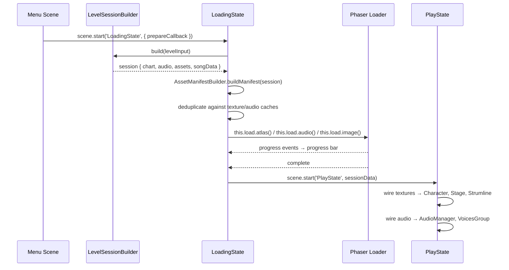

# Design Document: Asset Loading Pipeline

## Overview

This design connects the existing `funkin.assets` submodule files to Phaser's loader, texture cache, and audio cache so that BootScene, LoadingState, and PlayState can render sprites and play audio. The pipeline has three stages:

1. **Boot-time preloading** — BootScene loads core note skin atlases (notes, strumline receptors, splashes) that are shared across all songs.
2. **Per-song preloading** — LoadingState consumes the `assets` array from `LevelSessionBuilder.build()` and queues character atlases, stage prop images/atlases, and audio files through Phaser's loader, skipping anything already cached.
3. **Runtime wiring** — PlayState reads loaded textures and audio from the caches and hands them to Character, Stage, Strumline, AudioManager, and VoicesGroup.

All asset paths flow through a single `AssetPathResolver` utility and a new `AssetManifestBuilder` helper that collects every asset entry for a session, deduplicates by key, and returns a flat array for LoadingState.



## Architecture

The loading pipeline is split into three layers:

### Layer 1 — Asset Manifest Building (`AssetManifestBuilder`)
A pure-function module that takes a session object and the three registries (CharacterRegistry, StageRegistry, NoteStyleRegistry) and returns a flat `AssetEntry[]`. It resolves every character atlas, stage prop, and note style asset into `{ type, key, path }` entries. This module has no Phaser dependency and is fully unit-testable.

### Layer 2 — Phaser Loader Integration (changes to `BootScene` and `LoadingState`)
BootScene's `loadCoreAssets()` is updated to call `this.load.atlas()` for the default note style's note, strumline, and splash atlases. LoadingState's `prepareCallback` flow is extended: after `LevelSessionBuilder.build()` returns, it calls `AssetManifestBuilder.buildManifest()` to expand the session into the full asset list, then feeds that into the existing `loadAssets()` method which already handles deduplication via `isAssetLoaded()`.

### Layer 3 — Runtime Wiring (changes to `PlayState`)
After LoadingState transitions, PlayState receives the session data. It uses the loaded texture keys to set textures on Character sprites (via `this.setTexture(key)`), Stage props, and Strumline note sprites. It uses the loaded audio keys to call `AudioManager.loadInstrumental()` and `VoicesGroup.loadSplit()`/`loadCombined()`.

### Sparrow Atlas Loading Flow

For each Sparrow atlas (character, animated stage prop, note skin):

1. LoadingState calls `this.load.atlas(key, pngPath, xmlPath)` using Phaser's built-in XML atlas loader.
2. Phaser parses the Sparrow XML natively into its texture frame system.
3. After loading, a `registerAnimations()` helper iterates the character/prop animation definitions from the registry and calls `scene.anims.create()` with the correct frame names and rates.

This avoids manual `SparrowParser` usage at load time — Phaser's atlas loader handles the XML natively. `SparrowParser` remains available for runtime introspection (e.g., listing animation prefixes).

## Components and Interfaces

### AssetManifestBuilder (new module)

```
File: fnf-phaser/src/levels/AssetManifestBuilder.js
```

```javascript
/**
 * @typedef {Object} AssetEntry
 * @property {'atlas'|'image'|'audio'} type
 * @property {string} key - Phaser cache key
 * @property {string} path - URL/path to the primary file (PNG or audio)
 * @property {string} [atlasURL] - URL to the XML file (for atlas type)
 */

/**
 * Build a complete asset manifest from a session object.
 * @param {Object} session - Output of LevelSessionBuilder.build()
 * @param {Object} registries - { characterRegistry, stageRegistry, noteStyleRegistry }
 * @returns {AssetEntry[]}
 */
function buildManifest(session, registries) { ... }

/**
 * Build character atlas entries for a set of character IDs.
 * @param {string[]} characterIds
 * @param {Object} characterRegistry
 * @returns {AssetEntry[]}
 */
function buildCharacterEntries(characterIds, characterRegistry) { ... }

/**
 * Build stage prop entries for a stage ID.
 * @param {string} stageId
 * @param {Object} stageRegistry
 * @returns {AssetEntry[]}
 */
function buildStageEntries(stageId, stageRegistry) { ... }

/**
 * Build note style entries for a note style ID.
 * @param {string} noteStyleId
 * @param {Object} noteStyleRegistry
 * @returns {AssetEntry[]}
 */
function buildNoteStyleEntries(noteStyleId, noteStyleRegistry) { ... }

/**
 * Deduplicate entries by key, keeping the first occurrence.
 * @param {AssetEntry[]} entries
 * @returns {AssetEntry[]}
 */
function deduplicateEntries(entries) { ... }
```

### AnimationRegistrar (new helper)

```
File: fnf-phaser/src/graphics/AnimationRegistrar.js
```

```javascript
/**
 * Register Phaser animations for a character from registry data.
 * @param {Phaser.Scene} scene
 * @param {string} textureKey - The loaded atlas texture key
 * @param {Object[]} animations - Animation data array from CharacterRegistry
 */
function registerCharacterAnimations(scene, textureKey, animations) { ... }

/**
 * Register Phaser animations for a stage prop from registry data.
 * @param {Phaser.Scene} scene
 * @param {string} textureKey
 * @param {Object[]} animations - Animation data from StagePropData
 */
function registerPropAnimations(scene, textureKey, animations) { ... }
```

### Modified BootScene.loadCoreAssets()

The existing empty `loadCoreAssets()` method is updated to:
1. Resolve the default note style ID (e.g., `'funkin'`) from NoteStyleRegistry.
2. Call `buildNoteStyleEntries('funkin', noteStyleRegistry)` to get atlas entries.
3. For each entry, call `this.load.atlas(key, path, atlasURL)`.

### Modified LoadingState.prepareCallback flow

The `prepareAssets()` method already supports a `prepareCallback` that returns `{ assets, nextSceneData }`. The integration point is the callback itself, which will:
1. Call `LevelSessionBuilder.build(levelInput)`.
2. Call `AssetManifestBuilder.buildManifest(session, registries)`.
3. Merge the manifest entries with the session's existing audio `assets` array.
4. Return `{ assets: mergedEntries, nextSceneData: { chart, songData, audio, ... } }`.

### Modified LoadingState.loadAssets()

The existing `loadAssets()` method already handles `{ type, key, path }` objects and checks `isAssetLoaded()`. It needs one addition: support for `type: 'atlas'` entries that pass `path` (PNG) and `atlasURL` (XML) to `this.load.atlas()`.

### Path Resolution

All paths from registries go through `resolveAssetPath()` which returns relative paths like `images/shared/BOYFRIEND`. These are then prefixed with `assets/funkin.assets/` to form the full URL served by the Vite middleware. The prefixing happens in `AssetManifestBuilder` so that LoadingState receives ready-to-use URLs.

For paths already containing `assets/funkin.assets/` (like those in week manifests), the builder detects the prefix and passes them through unchanged.

## Data Models

### AssetEntry

```javascript
{
  type: 'atlas' | 'image' | 'audio',
  key: string,        // Phaser cache key, e.g. 'char-bf', 'stage-mainStage-stageback'
  path: string,       // Full URL path, e.g. 'assets/funkin.assets/shared/images/BOYFRIEND.png'
  atlasURL?: string   // XML path for atlas type, e.g. 'assets/funkin.assets/shared/images/BOYFRIEND.xml'
}
```

### Session Object (from LevelSessionBuilder — existing, extended)

The existing session object already contains:
- `audio` — `{ instrumental: { key, path }, vocals: { combined?, player?, opponent? } }`
- `assets` — `AssetEntry[]` (currently only audio entries)
- `chart`, `songData`, `metadata`, `level`, `song`

After `AssetManifestBuilder.buildManifest()`, the `assets` array is expanded to include character atlas entries, stage prop entries, and note style entries alongside the existing audio entries.

### Key Naming Conventions

| Asset Type | Key Pattern | Example |
|---|---|---|
| Character atlas | `char-{characterId}` | `char-bf` |
| Stage prop (image) | `stage-{stageId}-{propName}` | `stage-mainStage-stageback` |
| Stage prop (atlas) | `stage-{stageId}-{propName}` | `stage-mainStage-stagecurtains` |
| Note skin atlas | `notestyle-{styleId}-{assetKey}` | `notestyle-funkin-note` |
| Instrumental audio | `song-{songId}-instrumental` | `song-bopeebo-instrumental` |
| Player vocals | `song-{songId}-vocals-player` | `song-bopeebo-vocals-player` |
| Opponent vocals | `song-{songId}-vocals-opponent` | `song-bopeebo-vocals-opponent` |
| Combined vocals | `song-{songId}-vocals` | `song-tutorial-vocals` |


## Correctness Properties

*A property is a characteristic or behavior that should hold true across all valid executions of a system — essentially, a formal statement about what the system should do. Properties serve as the bridge between human-readable specifications and machine-verifiable correctness guarantees.*

### Property 1: Character manifest completeness

*For any* set of character IDs (player, opponent, girlfriend) in a session, `buildCharacterEntries()` should return exactly one atlas entry per unique character ID, where each entry's `key` matches `char-{characterId}` and its `path` ends with the character's `assetPath` resolved from CharacterRegistry plus `.png`.

**Validates: Requirements 2.1**

### Property 2: Animation registration completeness

*For any* character with N animation definitions in CharacterRegistry, calling `registerCharacterAnimations()` with the character's texture key and animation data should produce exactly N Phaser animation configs, each with the correct `key`, `frameRate`, and `repeat` values matching the registry data.

**Validates: Requirements 2.2**

### Property 3: Stage manifest correctness with type inference

*For any* stage ID with props defined in StageRegistry, `buildStageEntries()` should return one entry per prop that has a non-empty `assetPath`. Each entry's type should be `'atlas'` if the prop has a non-empty `animations` array, and `'image'` otherwise. Each entry's key should match `stage-{stageId}-{propName}`.

**Validates: Requirements 3.1, 3.3**

### Property 4: Full session manifest completeness

*For any* valid session object produced by LevelSessionBuilder, `buildManifest()` should return an array whose keys are a superset of: all audio entry keys from the session, all character atlas keys for the session's character IDs, all stage prop keys for the session's stage ID, and all note style keys for the session's note style ID. No expected key should be missing.

**Validates: Requirements 5.2**

### Property 5: Asset path prefixing correctness

*For any* atlas entry produced by `buildCharacterEntries()`, `buildStageEntries()`, or `buildNoteStyleEntries()` where the source registry path does not already start with `assets/funkin.assets/`, both the entry's `path` and `atlasURL` should start with `assets/funkin.assets/`.

**Validates: Requirements 6.1, 6.2**

### Property 6: Path prefix idempotence

*For any* asset path string that already starts with `assets/funkin.assets/`, applying the manifest builder's path resolution should return the path unchanged — the prefix should not be doubled.

**Validates: Requirements 6.3**

### Property 7: Cache-aware deduplication

*For any* array of AssetEntry objects and any set of already-cached keys, `deduplicateEntries()` followed by filtering against the cache should produce a list whose length equals the number of entries with keys not present in the cache. No cached key should appear in the output.

**Validates: Requirements 7.1, 7.2**

## Error Handling

| Scenario | Behavior |
|---|---|
| Core atlas PNG/XML fails to load in BootScene | BootScene's `loaderror` handler adds the key to `failedFiles`, displays error UI with retry button. Game does not proceed to title screen. |
| Character atlas fails to load in LoadingState | Warning logged. Gameplay proceeds; the Character sprite will have no texture (Phaser renders a green rectangle for missing textures). |
| Stage prop asset fails to load in LoadingState | Warning logged. Gameplay proceeds; the prop sprite will have no texture. Other props and characters render normally. |
| Audio file fails to load in LoadingState | Warning logged. Gameplay proceeds silently for that track. If instrumental fails, AudioManager.loadInstrumental() returns null and PlayState plays without music. If vocals fail, VoicesGroup operates with whichever tracks loaded. |
| LevelSessionBuilder.build() throws | LoadingState's existing `prepareAssets()` catch block sets `hasError = true` and displays the error message with retry/return-to-menu options. |
| Registry has no entry for a character/stage/noteStyle ID | `buildCharacterEntries()` / `buildStageEntries()` / `buildNoteStyleEntries()` returns an empty array for that ID and logs a warning. The manifest is still valid — it just won't include assets for the missing entry. |
| Phaser's atlas loader receives malformed XML | Phaser logs a console error and the texture key exists but has no frames. Sprites using that key render as blank. No crash. |

## Testing Strategy

### Unit Tests

Unit tests cover the pure-function modules with specific examples and edge cases:

- **AssetManifestBuilder**
  - `buildCharacterEntries()` with known character IDs produces expected entries
  - `buildStageEntries()` with a stage that has mixed animated/static props
  - `buildNoteStyleEntries()` with a style that has a fallback chain
  - `buildManifest()` with a complete session object
  - `deduplicateEntries()` removes duplicate keys, keeps first occurrence
  - Empty inputs (no characters, no stage, no note style) produce empty arrays
  - Paths already prefixed with `assets/funkin.assets/` are not double-prefixed

- **AnimationRegistrar**
  - `registerCharacterAnimations()` creates correct Phaser animation configs
  - `registerPropAnimations()` handles props with no animations (no-op)
  - Frame indices are respected when specified in animation data

- **Integration tests** (LoadingState + BootScene)
  - BootScene.loadCoreAssets() queues the expected atlas load calls
  - LoadingState prepareCallback flow produces correct nextSceneData
  - LoadingState skips already-cached assets

### Property-Based Tests

Property-based tests use `fast-check` with a minimum of 100 iterations per property. Each test is tagged with its design property reference.

- **Feature: asset-loading-pipeline, Property 1: Character manifest completeness** — Generate random sets of character IDs with mock registry data; verify entry count and key/path correctness.
- **Feature: asset-loading-pipeline, Property 2: Animation registration completeness** — Generate random animation definition arrays; verify output config count and field mapping.
- **Feature: asset-loading-pipeline, Property 3: Stage manifest correctness with type inference** — Generate random stage prop arrays with varying animation presence; verify entry types.
- **Feature: asset-loading-pipeline, Property 4: Full session manifest completeness** — Generate random session objects; verify manifest key superset property.
- **Feature: asset-loading-pipeline, Property 5: Asset path prefixing correctness** — Generate random registry-style paths without the prefix; verify both path and atlasURL are prefixed.
- **Feature: asset-loading-pipeline, Property 6: Path prefix idempotence** — Generate random paths that already include the prefix; verify no double-prefixing.
- **Feature: asset-loading-pipeline, Property 7: Cache-aware deduplication** — Generate random entry arrays and random cache key sets; verify filtered output length and absence of cached keys.

All property tests use `fast-check` (already available in the project's test environment via vitest). Each test runs a minimum of 100 iterations. Tests are located in `fnf-phaser/tests/AssetManifestBuilder.test.js` and `fnf-phaser/tests/AnimationRegistrar.test.js`.
