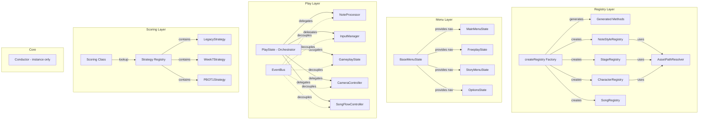

# Design Document: Codebase Simplification

## Overview

This design covers the refactoring of the fnf-phaser codebase to eliminate code duplication and reduce complexity across five major areas:

1. **Registry Factory Enhancement** — Extend `createRegistry()` to auto-generate common accessor/lister/path methods, eliminating ~60% of boilerplate in each concrete registry.
2. **Shared Asset Path Resolution** — Extract the duplicated `resolveAssetPath()` logic from NoteStyleRegistry (and similar patterns in other registries) into a single shared utility module.
3. **BaseMenuState Navigation Absorption** — Move the repeated navigation pattern (index wrapping, transition guards, scroll sounds, select/back guards) from each menu state into BaseMenuState.
4. **PlayState Decomposition** — Break the 1600+ line PlayState monolith into focused modules (NoteProcessor, InputManager, GameplayState, CameraController, SongFlowController) communicating via EventBus.
5. **Scoring Strategy Pattern** — Replace the switch-statement dispatch in Scoring with a strategy registry mapping each ScoringSystem to a strategy object.
6. **Conductor Singleton Cleanup** — Remove the redundant `getInstance()` method, keeping only `Conductor.instance`.

All changes preserve existing public APIs and pass existing tests without modification (except tests referencing `Conductor.getInstance()`).

## Architecture



### Design Decisions

1. **Generated methods via factory config, not code generation** — The `createRegistry()` factory reads an `entityName` from config and attaches methods to the prototype at creation time. This keeps the pattern declarative and avoids runtime overhead.

2. **Modules as plain objects with `init()`/`destroy()`** — PlayState sub-modules are plain JS objects (not classes) that receive a context object on init. This keeps them lightweight and avoids deep inheritance hierarchies.

3. **Strategy objects, not strategy classes** — Scoring strategies are plain objects with `scoreNote`, `judgeNote`, `getMissScore` methods. No class hierarchy needed for three static strategy objects.

4. **BaseMenuState provides opt-in navigation** — Subclasses that need the standard up/down/select/back pattern get it from `super.getInputBindings()`. Subclasses with custom navigation can override entirely.

## Components and Interfaces

### 1. Enhanced Registry Factory (`createRegistry`)

The factory gains an `entityName` config option. When present, it generates these methods on the prototype:

```javascript
// Config addition
createRegistry({
  registryId: 'NOTESTYLE',
  dataFilePath: 'data/notestyles',
  entityName: 'Style',           // NEW
  displayInfoFields: ['name', 'author', 'fallback'],  // NEW (optional)
  // ... existing config
}, { /* options */ });

// Generated methods (attached to prototype):
// get<EntityName>Data(id)       → fetchEntry(id)?.data ?? null
// get<EntityName>Name(id)       → fetchEntry(id)?.name ?? id
// list<EntityName>Ids()         → listEntryIds()
// get<EntityName>Path(id)       → `${dataFilePath}/${id}.json`
// get<EntityName>DisplayInfo(id)→ picks fields from entry based on displayInfoFields
// toString()                    → `<registryId>Registry(<count> <entityName>s)`
```

Custom methods in `options.methods` with the same name override generated ones.

### 2. Asset Path Resolver (`AssetPathResolver.js`)

New module at `fnf-phaser/src/utils/AssetPathResolver.js`:

```javascript
/**
 * @param {string|null} assetPath
 * @returns {string|null}
 */
export function resolveAssetPath(assetPath) {
  if (!assetPath) return null;
  if (assetPath.startsWith('shared:')) return `images/shared/${assetPath.slice(7)}`;
  if (assetPath.startsWith('default:')) return `images/preload/${assetPath.slice(8)}`;
  if (assetPath.includes(':')) {
    const [prefix, path] = assetPath.split(':');
    return `images/${prefix}/${path}`;
  }
  return `images/${assetPath}`;
}
```

NoteStyleRegistry, StageRegistry, and CharacterRegistry replace their local `resolveAssetPath` with an import from this module.

### 3. BaseMenuState Navigation

BaseMenuState gains:

```javascript
// Properties
selectedIndex = 0;

// Methods subclasses override
getItemCount()        // returns number of navigable items
updateSelection()     // re-renders selection highlight
executeSelection()    // performs the selected action
executeBack()         // performs the back action

// Provided by BaseMenuState (not overridden)
getInputBindings()    // default UP/DOWN/W/S/ENTER/SPACE/ESC/BACKSPACE bindings
onNavigateUp()        // guards, wraps index, plays sound, calls updateSelection()
onNavigateDown()      // guards, wraps index, plays sound, calls updateSelection()
onSelect()            // guards, sets transitioning, plays confirm, calls executeSelection()
onBack()              // guards, sets transitioning, plays cancel, calls executeBack()
```

Menu states like MainMenuState become simpler — they override `getItemCount()`, `updateSelection()`, `executeSelection()`, `executeBack()`, and optionally extend `getInputBindings()` via `super.getInputBindings()`.

### 4. PlayState Sub-Modules

Each module is a plain object created by a factory function:

```javascript
// NoteProcessor.js
export function createNoteProcessor(context) {
  return {
    checkMissedNotes() { /* ... */ },
    processOpponentNotes() { /* ... */ },
    hitNote(note, timing) { /* ... */ },
    missNote(note) { /* ... */ },
    ghostMiss(direction) { /* ... */ },
    opponentHitNote(note) { /* ... */ },
    destroy() { /* cleanup EventBus listeners */ }
  };
}

// InputManager.js
export function createInputManager(context) {
  return {
    processInputQueue() { /* ... */ },
    handleNoteInput(direction, timestamp) { /* ... */ },
    handleNoteRelease(direction, timestamp) { /* ... */ },
    destroy() { /* ... */ }
  };
}

// GameplayState.js
export function createGameplayState(context) {
  return {
    health, score, combo, tallies,  // state properties
    updateHealth(delta) { /* ... */ },
    updateScore(points) { /* ... */ },
    updateCombo(judgement) { /* ... */ },
    updateTallies(judgement, score) { /* ... */ },
    getHealthBonus(judgement) { /* ... */ },
    destroy() { /* ... */ }
  };
}

// CameraController.js
export function createCameraController(context) {
  return {
    focusCamera(target, instant) { /* ... */ },
    getCameraFocusCharacter(target) { /* ... */ },
    handleFocusCameraEvent(data) { /* ... */ },
    handleZoomCameraEvent(data) { /* ... */ },
    setupCameras() { /* ... */ },
    destroy() { /* ... */ }
  };
}

// SongFlowController.js
export function createSongFlowController(context) {
  return {
    startCountdown() { /* ... */ },
    scheduleCountdownStep(step) { /* ... */ },
    executeCountdownStep(step) { /* ... */ },
    startSong() { /* ... */ },
    endSong() { /* ... */ },
    gameOver() { /* ... */ },
    destroy() { /* ... */ }
  };
}
```

The `context` object provides access to shared state:

```javascript
const context = {
  scene,              // Phaser scene reference
  playState,          // PlayState instance (for strumlines, characters, etc.)
  conductor,          // Conductor.instance
  eventBus: EventBus, // EventBus static class
  scoring: Scoring,   // Scoring static class
  gameplayState,      // shared GameplayState module (set after creation)
};
```

PlayState's `update()` loop calls each module in order:
1. `inputManager.processInputQueue()`
2. `noteProcessor.processOpponentNotes()`
3. `noteProcessor.checkMissedNotes()`
4. Character/camera updates (delegated to CameraController)

### 5. Scoring Strategy Pattern

```javascript
// Strategy objects
const LegacyStrategy = {
  scoreNote(msTiming) { /* existing _scoreNoteLegacy logic */ },
  judgeNote(msTiming) { /* existing _judgeNoteLegacy logic */ },
  getMissScore() { return Constants.LEGACY_MISS_SCORE; }
};

const Week7Strategy = { /* ... */ };
const PBOT1Strategy = { /* ... */ };

// Registry
const strategies = {
  [ScoringSystem.LEGACY]: LegacyStrategy,
  [ScoringSystem.WEEK7]: Week7Strategy,
  [ScoringSystem.PBOT1]: PBOT1Strategy,
};

// Dispatch (replaces switch statements)
static scoreNote(msTiming, scoringSystem = ScoringSystem.PBOT1) {
  const strategy = strategies[scoringSystem] || strategies[ScoringSystem.PBOT1];
  return strategy.scoreNote(msTiming);
}
```

The public API (`scoreNote`, `judgeNote`, `getMissScore`, `calculateRank`, `createTallies`, etc.) remains identical.

### 6. Conductor Cleanup

Remove the `getInstance()` static method. The `static get instance()` getter remains the sole access point. Update any callers of `Conductor.getInstance()` to use `Conductor.instance`.

## Data Models

### Registry Config (Extended)

```javascript
/**
 * @typedef {Object} RegistryConfig
 * @property {string} registryId
 * @property {string} dataFilePath
 * @property {string} [versionRule='1.0.x']
 * @property {string} [entityName]           // NEW - triggers method generation
 * @property {string[]} [displayInfoFields]  // NEW - fields for getDisplayInfo
 * @property {function(Object, string=): *} cleanData
 * @property {function(Object, string=): boolean} [validateData]
 * @property {function(string, *): *} createEntry
 */
```

### Scoring Strategy Interface

```javascript
/**
 * @typedef {Object} ScoringStrategy
 * @property {function(number): number} scoreNote - Score based on ms timing offset
 * @property {function(number): string} judgeNote - Judgement based on ms timing offset
 * @property {function(): number} getMissScore - Score penalty for a miss
 */
```

### PlayState Module Context

```javascript
/**
 * @typedef {Object} PlayContext
 * @property {Phaser.Scene} scene
 * @property {PlayState} playState
 * @property {Conductor} conductor
 * @property {typeof EventBus} eventBus
 * @property {typeof Scoring} scoring
 * @property {Object} gameplayState - The GameplayState module instance
 */
```

### BaseMenuState Navigation Contract

```javascript
/**
 * Subclasses implementing list navigation must provide:
 * @method getItemCount() → number
 * @method updateSelection() → void
 * @method executeSelection() → void
 * @method executeBack() → void
 */
```


## Correctness Properties

*A property is a characteristic or behavior that should hold true across all valid executions of a system — essentially, a formal statement about what the system should do. Properties serve as the bridge between human-readable specifications and machine-verifiable correctness guarantees.*

### Property 1: Generated method existence

*For any* valid `entityName` string provided to `createRegistry()`, the resulting registry prototype SHALL have methods named `get<EntityName>Data`, `get<EntityName>Name`, `list<EntityName>Ids`, `get<EntityName>Path`, `get<EntityName>DisplayInfo`, and `toString`, and each SHALL be a function.

**Validates: Requirements 1.1, 1.6**

### Property 2: Generated accessor correctness

*For any* registry created with `entityName` and *for any* string `id`, calling the generated `get<EntityName>Data(id)` SHALL return `fetchEntry(id)?.data ?? null`, and calling `get<EntityName>Name(id)` SHALL return `fetchEntry(id)?.name ?? id`. This covers both valid entry IDs (returning data) and non-existent IDs (returning null or the id itself).

**Validates: Requirements 1.2, 1.3**

### Property 3: Custom method override

*For any* registry created with both an `entityName` and a custom method in `options.methods` whose name matches a generated method name, the registry instance SHALL use the custom method's implementation (not the generated one).

**Validates: Requirements 1.4**

### Property 4: DisplayInfo field selection

*For any* registry created with `entityName` and a `displayInfoFields` array, and *for any* loaded entry, calling the generated `getDisplayInfo(id)` SHALL return an object containing exactly the `id` field plus the fields listed in `displayInfoFields`, with values sourced from the entry.

**Validates: Requirements 1.5**

### Property 5: Asset path resolution

*For any* non-null, non-empty path string, `resolveAssetPath` SHALL produce a result matching: `shared:<p>` → `images/shared/<p>`, `default:<p>` → `images/preload/<p>`, `<prefix>:<p>` → `images/<prefix>/<p>`, and `<p>` (no colon) → `images/<p>`. For null or empty input, it SHALL return null.

**Validates: Requirements 2.1, 2.2, 2.3, 2.4, 2.5**

### Property 6: Navigation index wrapping

*For any* item count ≥ 1 and *for any* starting `selectedIndex` in `[0, itemCount)`, calling `onNavigateUp()` SHALL set `selectedIndex` to `(selectedIndex - 1 + itemCount) % itemCount`, and calling `onNavigateDown()` SHALL set `selectedIndex` to `(selectedIndex + 1) % itemCount`, provided `transitioning` is false.

**Validates: Requirements 3.1, 3.7, 3.8**

### Property 7: Transition guard idempotence

*For any* BaseMenuState subclass where `transitioning` is `true`, calling `onSelect()` or `onBack()` SHALL not change `transitioning`, not call `executeSelection()`/`executeBack()`, and not call any sound methods. When `transitioning` is `false`, calling `onSelect()` or `onBack()` SHALL set `transitioning` to `true` and invoke the corresponding execute method exactly once.

**Validates: Requirements 3.5, 3.6**

### Property 8: Module destroy cleanup

*For any* set of PlayState sub-modules that have registered EventBus listeners, calling `destroy()` on PlayState SHALL result in all module-registered EventBus listeners being removed (listener count for module-specific events returns to zero).

**Validates: Requirements 4.8**

### Property 9: Scoring strategy dispatch equivalence

*For any* `msTiming` value and *for any* valid `ScoringSystem` enum value, `Scoring.scoreNote(msTiming, system)` SHALL return the same value as the corresponding strategy object's `scoreNote(msTiming)`, `Scoring.judgeNote(msTiming, system)` SHALL return the same value as the strategy's `judgeNote(msTiming)`, and `Scoring.getMissScore(system)` SHALL return the same value as the strategy's `getMissScore()`.

**Validates: Requirements 5.3, 5.4, 5.5**

### Property 10: Unknown scoring system fallback

*For any* string that is not a valid `ScoringSystem` enum value, `Scoring.scoreNote(msTiming, unknownSystem)` SHALL return the same result as `Scoring.scoreNote(msTiming, ScoringSystem.PBOT1)`, and likewise for `judgeNote` and `getMissScore`.

**Validates: Requirements 5.6**

### Property 11: Generated method behavioral equivalence

*For any* registry where a generated method replaces a previously hand-written method, and *for any* valid input to that method, the generated method SHALL produce an identical return value to what the hand-written method would have produced.

**Validates: Requirements 7.4**

## Error Handling

### Registry Factory
- If `entityName` is provided but is not a non-empty string, the factory logs a warning and skips method generation (registry still works without generated methods).
- If `displayInfoFields` references a field that doesn't exist on an entry, that field is omitted from the display info object (no error thrown).

### Asset Path Resolver
- Null, undefined, and empty string inputs return `null`.
- Paths with multiple colons split only on the first colon (e.g., `prefix:path:extra` → `images/prefix/path:extra`).

### BaseMenuState Navigation
- If `getItemCount()` returns 0, `onNavigateUp()` and `onNavigateDown()` are no-ops (guard against division by zero in modulo).
- If a subclass doesn't override `executeSelection()` or `executeBack()`, the default implementations are no-ops.

### PlayState Modules
- If a module's `destroy()` is called multiple times, subsequent calls are no-ops (idempotent cleanup).
- If EventBus emits an event and no module is listening, the event is silently dropped (existing EventBus behavior).

### Scoring
- Unrecognized `scoringSystem` values fall back to PBOT1 (no error thrown).
- `msTiming` of `NaN` or `Infinity` is handled by the strategy's threshold checks naturally returning miss scores.

### Conductor
- After removing `getInstance()`, any code calling it will get a `TypeError` at runtime. The migration must be complete before merging.

## Testing Strategy

### Dual Testing Approach

Both unit tests and property-based tests are required:

- **Unit tests** (Vitest): Verify specific examples, edge cases, integration points, and error conditions.
- **Property-based tests** (fast-check via Vitest): Verify universal properties across randomized inputs with minimum 100 iterations per property.

### Property-Based Testing Configuration

- **Library**: [fast-check](https://github.com/dubzzz/fast-check) integrated with Vitest
- **Minimum iterations**: 100 per property test
- **Tag format**: Each property test must include a comment: `// Feature: codebase-simplification, Property N: <property text>`
- **Each correctness property is implemented by a single property-based test**

### Test Plan by Component

**Registry Factory (Properties 1–4, 11)**
- Property tests: Generate random entityName strings, random entry data, random displayInfoFields arrays. Verify generated methods exist, return correct values, and can be overridden.
- Unit tests: Specific examples with NoteStyleRegistry, StageRegistry configs. Verify toString format.

**Asset Path Resolver (Property 5)**
- Property tests: Generate random prefix/path string pairs, verify resolution follows the prefix rules.
- Unit tests: Edge cases — null, empty string, paths with multiple colons, `shared:` and `default:` prefixes.

**BaseMenuState Navigation (Properties 6–7)**
- Property tests: Generate random item counts and starting indices, verify wrapping math. Generate random transitioning states, verify guard behavior.
- Unit tests: Specific menu state scenarios, verify sound method calls, verify updateSelection is called.

**PlayState Modules (Property 8)**
- Property tests: Register random numbers of EventBus listeners across modules, call destroy, verify all removed.
- Unit tests: Verify each module's methods exist. Verify PlayState update loop calls modules in order. Verify destroy is idempotent.

**Scoring Strategy (Properties 9–10)**
- Property tests: Generate random msTiming values across the full range, verify dispatch matches direct strategy calls. Generate random invalid scoring system strings, verify PBOT1 fallback.
- Unit tests: Specific timing values at threshold boundaries. Verify all three strategies have required methods.

**Conductor Cleanup**
- Unit tests: Verify `Conductor.instance` returns a Conductor. Verify `getInstance` does not exist. Verify `reset()` creates a fresh instance.

**Backward Compatibility (Property 11)**
- Property tests: For each registry, generate random entry data, load it, and compare generated method output against the known hand-written behavior.
- Unit tests: Run existing test suites unchanged (except Conductor.getInstance tests).
