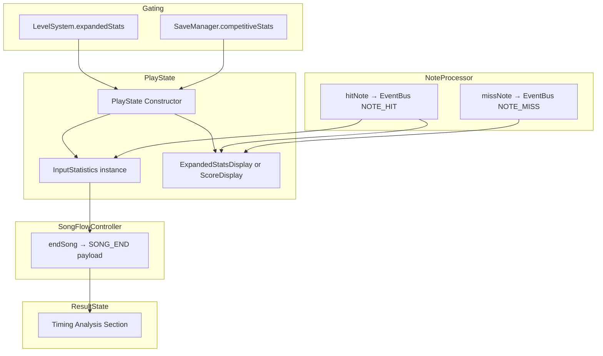

# Design Document: Competitive Stats Integration

## Overview

This design covers the integration of four existing, fully-tested modules — InputStatistics, ExpandedStatsDisplay, NPSMeter, and GradeDisplay — into the live game loop. No new modules are created. The work modifies three existing files: PlayState, SongFlowController, and ResultState. SaveManager needs a minor addition of default keys for HUD visibility options.

OptionsState already has a "HUD Stats" category with individual toggles for showNPS, showGrade, showComboBreaks, and showJudgements — no changes needed there.

The integration uses the existing `expandedStats` feature flag in LevelSystem to gate whether ExpandedStatsDisplay or ScoreDisplay is used. In freeplay mode (no LevelSystem), the feature defaults to enabled.

Data flows in one direction during gameplay:

```
NoteProcessor.hitNote() → EventBus NOTE_HIT → PlayState handler
  ├─→ InputStatistics.recordHit(timing, judgement)
  └─→ ExpandedStatsDisplay.recordHit(judgement, timestamp)

NoteProcessor.missNote() → EventBus NOTE_MISS / COMBO_BREAK
  └─→ ExpandedStatsDisplay.recordComboBreak()

SongFlowController.endSong()
  └─→ Includes InputStatistics.getStats() in SONG_END payload → ResultState
```

## Architecture

The integration touches the existing module architecture without adding new modules or changing existing APIs.



### Gating Logic

PlayState determines at initialization whether competitive stats are active using the existing `expandedStats` feature flag:

```javascript
isCompetitiveStatsEnabled() {
  const featureEnabled = this.levelSystem
    ? this.levelSystem.isFeatureEnabled('expandedStats')
    : true; // freeplay default — no LevelSystem means all features available
  return featureEnabled;
}
```

This method gates both InputStatistics creation and ExpandedStatsDisplay vs ScoreDisplay selection.

## Components and Interfaces

### Modified Components

#### 1. PlayState (fnf-phaser/src/play/PlayState.js)

New properties:
- `inputStatistics` — `InputStatistics | null`, created when competitive stats enabled
- `competitiveStatsEnabled` — `boolean`, cached result of gating check

New methods:
- `isCompetitiveStatsEnabled()` — returns boolean based on `expandedStats` feature flag (or true in freeplay)
- `createHUDDisplay()` — instantiates ExpandedStatsDisplay or ScoreDisplay based on gate

Modified methods:
- `constructor()` — initializes `inputStatistics = null`, `competitiveStatsEnabled = false`
- `init()` — calls `isCompetitiveStatsEnabled()`, creates InputStatistics if enabled
- `resetState()` — calls `inputStatistics.reset()` if present
- `destroy()` — sets `inputStatistics = null`

EventBus integration (in existing NOTE_HIT handler flow):
```javascript
// After existing hit processing
if (this.inputStatistics) {
  this.inputStatistics.recordHit(timing, judgement);
}
if (this.scoreDisplay instanceof ExpandedStatsDisplay) {
  this.scoreDisplay.recordHit(judgement, timestamp);
}
```

#### 2. SongFlowController (fnf-phaser/src/play/SongFlowController.js)

Modified method:
- `endSong()` — adds `timingStats` to SONG_END event payload and `onSongEnd` callback:
```javascript
const timingStats = playState.inputStatistics?.getStats() ?? null;
eventBus.emit(Events.SONG_END, {
  score, tallies, rank, replayData, isReplay, timingStats
});
if (playState.onSongEnd) {
  playState.onSongEnd(score, tallies, rank, replayData, timingStats);
}
```

#### 3. ResultState (fnf-phaser/src/ui/ResultState.js)

New property:
- `timingStats` — `TimingStats | null`

Modified methods:
- `init(data)` — stores `data.timingStats` if present
- `create()` — calls `createTimingAnalysis()` if `timingStats` is available
- `shutdown()` — sets `timingStats = null`

New method:
- `createTimingAnalysis()` — renders timing analysis section:
  - Average offset (e.g., "Avg: -3.2ms (Early)")
  - Early/Late/Perfect ratio (e.g., "Early: 45 | Late: 38 | Perfect: 12")
  - Per-judgement average offsets

#### 4. SaveManager (fnf-phaser/src/data/SaveManager.js)

Modified: Adds `showNPS: true`, `showGrade: true`, `showComboBreaks: true`, `showJudgements: false` to `DEFAULT_OPTIONS`. The existing merge logic ensures old saves without these keys get the defaults. (OptionsState already has the UI toggles for these — this just ensures SaveManager has matching defaults.)

### Already Implemented (No Changes Needed)

#### OptionsState (fnf-phaser/src/ui/OptionsState.js)

Already has a "HUD Stats" category with toggles for NPS Meter, Grade Display, Combo Breaks, and Judgements. Also has a "Competitive" category with Input Buffer and Input Delay. No modifications required.

### Unchanged Module APIs

The following modules are NOT modified — their public APIs remain identical:
- `InputStatistics` — `recordHit`, `getStats`, `getEarlyLateRatio`, `getDistribution`, `reset`, `totalHits`
- `ExpandedStatsDisplay` — `recordHit`, `recordComboBreak`, `update`, `buildText`, `resetStats`, `setExpandedVisibility`, `getCurrentNPS`, `getPeakNPS`, `getCurrentGrade`, `getComboBreaks`, `getJudgements`
- `NPSMeter` — `recordHit`, `update`, `getCurrentNPS`, `getPeakNPS`, `getAverageNPS`, `getTotalHits`, `reset`
- `GradeDisplay` — `updateGrade`, `calculateGrade`, `getCurrentGrade`, `getPreviousGrade`, `hasGradeChanged`, `getGradeChange`, `getGradeIndex`, `reset`

## Data Models

### TimingStats (from InputStatistics.getStats())

Already defined in InputStatistics — no new types needed:

```javascript
{
  averageOffset: number,    // ms, negative = early
  earlyCount: number,
  lateCount: number,
  perfectCount: number,
  offsets: number[],
  byJudgement: {
    [judgement: string]: { count: number, avgOffset: number }
  }
}
```

### SONG_END Event Payload (extended)

```javascript
{
  score: number,
  tallies: Tallies,
  rank: string,
  replayData: object | null,
  isReplay: boolean,
  timingStats: TimingStats | null  // NEW
}
```

### SaveManager DEFAULT_OPTIONS (extended)

```javascript
{
  // ... existing options ...
  showNPS: true,           // NEW
  showGrade: true,         // NEW
  showComboBreaks: true,   // NEW
  showJudgements: false    // NEW
}
```


## Correctness Properties

*A property is a characteristic or behavior that should hold true across all valid executions of a system — essentially, a formal statement about what the system should do. Properties serve as the bridge between human-readable specifications and machine-verifiable correctness guarantees.*

### Property 1: Feature-flag-gated HUD selection

*For any* `expandedStats` feature flag boolean value, and for any LevelSystem state (present with flag, present without flag, or absent):
- When the flag is true (or LevelSystem is absent), PlayState SHALL use ExpandedStatsDisplay and create InputStatistics.
- When the flag is false, PlayState SHALL use ScoreDisplay and InputStatistics SHALL be null.

The truth table is:

| LevelSystem | expandedStats | HUD Type | InputStatistics |
|---|---|---|---|
| present | true | ExpandedStatsDisplay | created |
| present | false | ScoreDisplay | null |
| absent | — | ExpandedStatsDisplay | created |

**Validates: Requirements 2.1, 2.2, 4.1, 4.2, 4.3**

### Property 2: NOTE_HIT data flows to both InputStatistics and ExpandedStatsDisplay

*For any* note hit event with any valid timing offset (number) and any valid judgement string (killer, sick, good, bad, shit), when competitive stats are enabled:
- `InputStatistics.getStats().offsets` SHALL contain the timing offset
- `ExpandedStatsDisplay.getJudgements()` SHALL reflect the incremented judgement count

**Validates: Requirements 1.2, 2.3**

### Property 3: Combo break counter increments on COMBO_BREAK

*For any* sequence of N COMBO_BREAK events emitted via EventBus, the ExpandedStatsDisplay's combo break counter (`getComboBreaks()`) SHALL equal N.

**Validates: Requirements 2.4**

### Property 4: ExpandedStatsDisplay visibility reflects SaveManager options

*For any* combination of boolean values for `(showNPS, showGrade, showComboBreaks, showJudgements)` stored in SaveManager, when ExpandedStatsDisplay is created, its `visibilityOptions` SHALL match those stored values.

**Validates: Requirements 2.6**

### Property 5: ResultState timing analysis display completeness

*For any* valid TimingStats object (with non-empty offsets and at least one judgement with hits), the ResultState timing analysis section SHALL contain:
- The average offset value with the correct "Early" or "Late" label (negative = Early, positive = Late)
- The early, late, and perfect hit counts
- Per-judgement average offsets for each judgement that has recorded hits

**Validates: Requirements 3.2, 3.3, 3.4**

## Error Handling

### Null/Missing Data

- **No LevelSystem**: `isCompetitiveStatsEnabled()` treats `expandedStats` as enabled (freeplay default). No error thrown.
- **No timingStats in ResultState**: `init()` sets `timingStats = null`. `create()` skips the timing analysis section entirely. The rest of the results screen renders normally.
- **SaveManager missing HUD keys**: `getOption()` falls back to DEFAULT_OPTIONS values via the existing merge logic.

### Destroy/Cleanup

- PlayState `destroy()` sets `inputStatistics = null` after the existing cleanup chain. No dangling references.
- ResultState `shutdown()` sets `timingStats = null`.
- ExpandedStatsDisplay `destroy()` already cleans up NPSMeter and GradeDisplay references.

### Edge Cases

- **Zero notes hit**: InputStatistics returns `averageOffset: 0`, empty `byJudgement` stats. ResultState displays "0.0ms" with no early/late label.
- **Competitive stats toggled mid-session**: The toggle only takes effect on the next song start (PlayState `init()`). Mid-song changes have no effect on the current session.
- **Replay mode**: InputStatistics still records hits during replay playback since the same NOTE_HIT events fire. This is intentional — replay analysis benefits from timing stats.

## Testing Strategy

### Testing Approach

This integration uses a dual testing approach:
- **Unit tests**: Verify specific integration wiring, initialization, cleanup, and edge cases
- **Property-based tests**: Verify universal properties across randomized inputs using `fast-check`

### Property-Based Testing Configuration

- Library: `fast-check` (JavaScript property-based testing)
- Minimum iterations: 100 per property test
- Each property test references its design document property via comment tag
- Tag format: `Feature: competitive-stats-integration, Property {N}: {title}`

### Unit Tests

Unit tests cover specific examples and edge cases not suited to property testing:

1. **PlayState initialization** — verify InputStatistics is created when expandedStats feature enabled (Req 1.1)
2. **PlayState destroy** — verify InputStatistics is set to null (Req 1.4)
3. **PlayState reset** — verify InputStatistics.reset() is called (Req 1.5)
4. **SongFlowController endSong** — verify timingStats in SONG_END payload (Req 1.3)
5. **ResultState with no timingStats** — verify timing section is absent (Req 3.5)
6. **ResultState init stores timingStats** — verify data is stored (Req 3.1)
7. **Freeplay mode default** — verify no LevelSystem defaults expandedStats to true (Req 4.3)
8. **SaveManager defaults** — verify showNPS, showGrade, showComboBreaks, showJudgements have correct defaults (Req 5.1, 5.2)
9. **ExpandedStatsDisplay update receives currentTime** — verify update called with song time (Req 2.5)
10. **ExpandedStatsDisplay reads visibility from SaveManager** — verify initial visibility matches saved options (Req 4.4)

### Property-Based Tests

Each correctness property maps to exactly one property-based test:

1. **Feature: competitive-stats-integration, Property 1: Feature-flag-gated HUD selection**
   - Generate: random boolean for `expandedStats` and random boolean for `hasLevelSystem`
   - Assert: HUD type and InputStatistics presence match the truth table

2. **Feature: competitive-stats-integration, Property 2: NOTE_HIT data flows to both targets**
   - Generate: random arrays of `{timing: float(-160, 160), judgement: oneof('killer','sick','good','bad','shit')}`
   - Assert: After emitting all hits, InputStatistics offsets contain all timings, ExpandedStatsDisplay judgement counts match

3. **Feature: competitive-stats-integration, Property 3: Combo break counter increments**
   - Generate: random integer N (1–100)
   - Assert: After N COMBO_BREAK events, `getComboBreaks() === N`

4. **Feature: competitive-stats-integration, Property 4: Visibility reflects SaveManager**
   - Generate: random booleans for `showNPS`, `showGrade`, `showComboBreaks`, `showJudgements`
   - Assert: ExpandedStatsDisplay visibilityOptions match the generated values

5. **Feature: competitive-stats-integration, Property 5: ResultState timing analysis completeness**
   - Generate: random TimingStats with random offsets and judgement distributions
   - Assert: Rendered text contains average offset with correct early/late label, all three ratio counts, and per-judgement averages for non-empty judgements
