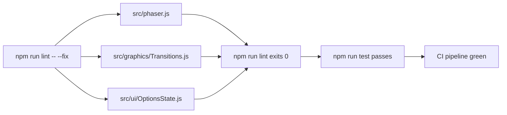

# Design Document: Lint and CI Green Baseline

## Overview

This design covers fixing 20 ESLint/Prettier errors across 3 source files so that `npm run lint` exits cleanly and the CI pipeline passes end-to-end. All errors are auto-fixable — no manual code changes or semantic modifications are required.

The fix is a single command: `npm run lint -- --fix` run from the `fnf-phaser` directory.

### Error Breakdown

| File | Errors | Rule | Root Cause |
|------|--------|------|------------|
| `src/phaser.js` | 16 | `prettier/prettier` | 4-space indentation instead of 2-space |
| `src/graphics/Transitions.js` | 1 | `prettier/prettier` | Vector2 constructor args split across lines unnecessarily |
| `src/ui/OptionsState.js` | 3 | `curly` | Missing curly braces on single-line `if` bodies |

### Design Rationale

- **Auto-fix over manual edits**: ESLint's `--fix` flag handles all 20 errors correctly, eliminating human error.
- **No config changes**: The lint rules are correct; the code simply doesn't conform yet.
- **No semantic changes**: Formatting and brace insertion do not alter runtime behavior.

## Architecture

No architectural changes. This is a formatting-only fix applied to existing source files.



## Components and Interfaces

No new components or interfaces. The fix touches three existing files:

### src/phaser.js
- **Change**: Re-indent from 4 spaces to 2 spaces (16 lines affected)
- **Scope**: The entire Proxy wrapper block
- **Impact**: None — whitespace only

### src/graphics/Transitions.js
- **Change**: Collapse `new Phaser.Math.Vector2(cx + radius * Math.cos(angle), cy + radius * Math.sin(angle))` onto a single line
- **Scope**: One statement inside the star-path loop (~line 509)
- **Impact**: None — identical expression

### src/ui/OptionsState.js
- **Change**: Add curly braces to 3 `if` statements in `_applyLiveVolumePreview()`
- **Scope**: Lines 806, 812, 813 (the `if (!audioCategory)`, `if (item.key === 'masterVolume')`, `if (item.key === 'musicVolume')` statements)
- **Impact**: None — identical control flow

## Data Models

No data model changes.

## Error Handling

No error handling changes. If `npm run lint -- --fix` fails for any reason (file permissions, disk full), the developer re-runs the command. The fix is idempotent.

## Testing Strategy

**PBT is not applicable** for this feature. All acceptance criteria are either SMOKE checks (does the linter pass?) or INTEGRATION checks (does the existing test suite still pass?). There are no functions with varying inputs to test, no transformations, and no logic changes. The formatting changes are purely cosmetic.

### Verification Approach

1. **Lint verification** (SMOKE): Run `npm run lint` and confirm exit code 0 with zero errors/warnings.
2. **Test regression** (INTEGRATION): Run `npm run test` and confirm all 2,433 unit tests pass.
3. **Integration tests** (INTEGRATION): Run `npm run test:integration` and confirm all 4 tests pass.
4. **Type check** (SMOKE): Run `npm run typecheck` and confirm zero type errors.
5. **Build** (SMOKE): Run `npm run build` and confirm successful output.
6. **Config integrity** (SMOKE): Verify via `git diff` that `eslint.config.js` and `.prettierrc.js` are unmodified.
7. **No suppressions** (SMOKE): Grep changed files for `eslint-disable` — expect zero matches.

### Execution Order

```bash
cd fnf-phaser
npm run lint -- --fix    # Apply all 20 fixes
npm run lint             # Verify zero errors
npm run typecheck        # Verify types still clean
npm run test             # Verify unit tests pass
npm run test:integration # Verify integration tests pass
npm run build            # Verify build succeeds
```

All steps must pass. If any step fails, investigate before proceeding — a formatting-only change should never break tests or types.
