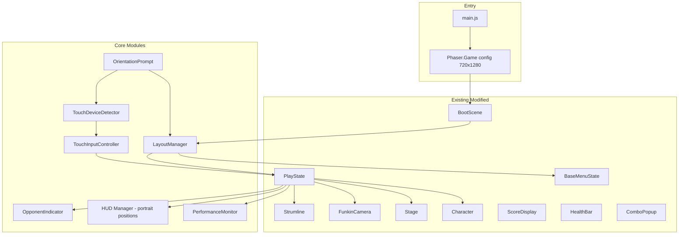

# Design Document: Mobile Portrait Mode

## Overview

This design converts the Friday Night Funkin' Phaser.js game from its current 1280x720 landscape layout to a universal 720x1280 portrait (9:16) layout. The portrait canvas is the sole viewport on all platforms. On desktop, the canvas is centered with black letterboxing; on mobile, touch controls appear at the bottom. The game remains a Phaser 3 browser application.

The key architectural changes are:
1. Swap the Phaser game config from 1280x720 to 720x1280 and keep `Phaser.Scale.FIT` with `CENTER_BOTH`
2. Introduce a `LayoutManager` module that owns portrait-specific constants and provides coordinate helpers
3. Introduce a `TouchDeviceDetector` that determines touch capability (used only for showing/hiding touch controls)
4. Introduce a `TouchInputController` that renders four touch zones and feeds directional inputs into the existing input queue
5. Introduce an `OpponentIndicator` widget replacing the full opponent strumline
6. Reposition the single player `Strumline` to center horizontally in downscroll
7. Reposition all HUD elements (health bar, score, combo popup) for the narrower, taller canvas
8. Adapt `Stage`, `Character`, `FunkinCamera`, and all menu states for portrait framing
9. Add an orientation prompt overlay for mobile landscape visitors
10. Add a lightweight performance monitor that disables non-essential effects when FPS drops

The design intentionally avoids a dual-layout system. Portrait is the only layout; the existing landscape constants are replaced, not toggled.

## Architecture



### Module Dependency Summary

| New Module | Depends On | Depended On By |
|---|---|---|
| `LayoutManager` | Constants | PlayState, all menu states, HUD components |
| `TouchDeviceDetector` | Browser APIs | TouchInputController, OrientationPrompt, menu states |
| `TouchInputController` | LayoutManager, TouchDeviceDetector | PlayState (input queue) |
| `OpponentIndicator` | LayoutManager | PlayState |
| `OrientationPrompt` | TouchDeviceDetector, LayoutManager | BootScene / root scene |
| `PerformanceMonitor` | Phaser.Game | PlayState, FunkinCamera, NoteSplash |

## Components and Interfaces

### 1. LayoutManager (`src/layout/LayoutManager.js`)

A pure-data module exporting portrait layout constants and coordinate helper functions. No class instantiation needed — just exported constants and functions.

```js
// Key exports
export const PORTRAIT_WIDTH = 720;
export const PORTRAIT_HEIGHT = 1280;
export const ASPECT_RATIO = 9 / 16;

// Strumline positioning
export const PLAYER_STRUMLINE_X = 136;  // centers 4 lanes (4*112=448) in 720px
export const PLAYER_STRUMLINE_Y = 900;  // receptor Y, above touch zone
export const TOUCH_ZONE_HEIGHT = 160;   // bottom touch area height
export const TOUCH_ZONE_Y = 1120;       // 1280 - 160

// HUD positioning
export const HEALTH_BAR_Y = 80;
export const HEALTH_BAR_WIDTH = 640;
export const SCORE_DISPLAY_Y = 120;
export const COMBO_POPUP_Y = 500;

// Opponent indicator
export const OPPONENT_INDICATOR_X = 16;
export const OPPONENT_INDICATOR_Y = 16;
export const OPPONENT_ARROW_SIZE = 28;

// Stage/camera
export const DEFAULT_PORTRAIT_ZOOM = 1.4;
export const PLAYER_CHAR_Y_RANGE = [300, 700]; // visible area between HUD and strumline
```

### 2. TouchDeviceDetector (`src/input/TouchDeviceDetector.js`)

Detects touch capability. Singleton, evaluated once at boot and re-evaluated on first touch/pointer event.

```js
class TouchDeviceDetector {
  static isTouchDevice = false;
  static evaluated = false;

  static detect()          // initial detection via navigator, matchMedia
  static onFirstTouch()    // upgrades isTouchDevice to true on first touch event
  static isTouch()         // returns current state
}
```

Interface:
- `TouchDeviceDetector.detect()` — called in BootScene.create()
- `TouchDeviceDetector.isTouch()` — queried by TouchInputController, menu states, OrientationPrompt

### 3. TouchInputController (`src/input/TouchInputController.js`)

Renders four touch zones at the bottom of the portrait canvas and translates touch events into the PlayState input queue.

```js
class TouchInputController {
  constructor(scene, inputQueue)
  create()                    // creates 4 zone graphics + arrow icons
  show() / hide()             // visibility toggle
  onPointerDown(pointer)      // maps pointer.x to zone, pushes press to queue
  onPointerUp(pointer)        // pushes release to queue
  onPointerMove(pointer)      // handles drag between zones
  update()                    // visual feedback (pressed state)
  destroy()
}
```

Each zone is a `Phaser.GameObjects.Rectangle` with an arrow icon overlay. Zones are sized to `PORTRAIT_WIDTH / 4` wide × `TOUCH_ZONE_HEIGHT` tall. Multi-touch is handled via Phaser's pointer system (pointers 1-4 enabled).

The controller pushes `{ direction, timestamp }` objects into the same `inputPressQueue` / `inputReleaseQueue` arrays that PreciseInput uses, so the existing note hit detection in PlayState works unchanged.

### 4. OpponentIndicator (`src/play/OpponentIndicator.js`)

A lightweight widget showing four small arrow icons in the top-left corner. When the opponent hits a note, the corresponding arrow flashes.

```js
class OpponentIndicator {
  constructor(scene, config)
  create()                        // creates 4 arrow sprites/graphics
  flash(direction)                // highlights arrow for 150ms
  update(delta)                   // fades arrows back to idle
  setPosition(x, y)
  destroy()
}
```

PlayState calls `opponentIndicator.flash(direction)` instead of updating a full opponent strumline. The existing `opponentStrumline` is still created internally for note timing/scoring but is not rendered (visible = false).

### 5. OrientationPrompt (`src/ui/OrientationPrompt.js`)

An overlay shown when a touch device is in landscape orientation.

```js
class OrientationPrompt {
  constructor(scene)
  create()                        // creates full-screen overlay with rotate icon + text
  checkOrientation()              // reads window.innerWidth/innerHeight or screen.orientation
  show() / dismiss()
  destroy()
}
```

Listens to `window.addEventListener('resize', ...)` and `screen.orientation?.addEventListener('change', ...)`. Dismisses within 500ms of portrait detection.

### 6. PerformanceMonitor (`src/core/PerformanceMonitor.js`)

Tracks FPS and signals when to reduce visual effects.

```js
class PerformanceMonitor {
  constructor(game)
  update(delta)                   // tracks rolling FPS average
  isLowPerformance()              // true if avg FPS < 30 for 1 second
  shouldReduceEffects()           // same as isLowPerformance
}
```

When `isLowPerformance()` returns true, PlayState disables camera zoom bops (`funkinCamera.setBeatZoomEnabled(false)`) and note splashes (`noteSplash.setEnabled(false)`).

### 7. Modifications to Existing Modules

#### main.js
- Change `width: 1280, height: 720` → `width: 720, height: 1280`
- Scale mode stays `Phaser.Scale.FIT` with `CENTER_BOTH` (this gives letterboxing for free)
- Enable multi-touch: `input: { activePointers: 4 }`

#### Constants.js
- Add portrait layout constants or import from LayoutManager
- Update `STRUMLINE_X_OFFSET` and `STRUMLINE_Y_OFFSET` to portrait values

#### PlayState
- Create only one visible strumline (player), centered horizontally, forced downscroll
- Create opponent strumline hidden (for timing only), wire `opponentHitNote` to `OpponentIndicator.flash()`
- Create `TouchInputController` if `TouchDeviceDetector.isTouch()`
- Create `PerformanceMonitor`, check each frame
- Reposition HUD elements using LayoutManager constants

#### Strumline
- No structural changes. Position and downscroll flag are set by PlayState using LayoutManager values.

#### FunkinCamera
- `setDefaultZoom()` uses `LayoutManager.DEFAULT_PORTRAIT_ZOOM` (higher zoom to fill narrow canvas)
- Existing follow/lerp logic works unchanged

#### Stage
- `applyStageData()` adjusts character positions for portrait framing
- Player character centered; opponent shifted to side/partially off-screen
- Background props scaled to cover 720x1280

#### Character
- No structural changes. Positioning is handled by Stage.

#### HealthBar
- Constructed with `width: 640`, positioned at `y: 80`, centered at `x: 40`

#### ScoreDisplay
- Positioned at `y: 120`, centered horizontally

#### ComboPopup
- Positioned at `y: 500` (between health bar and strumline receptors)

#### BaseMenuState
- `createBackground()` uses `720x1280` dimensions from `this.cameras.main`
- No hardcoded 1280x720 references (already uses `this.cameras.main.width/height`)

#### All Menu States (TitleState, MainMenuState, FreeplayState, OptionsState, StoryMenuState)
- Already use `this.cameras.main.width/height` for positioning — they adapt automatically
- Add touch interactivity: make menu items tappable with `setInteractive()` and `on('pointerdown', ...)`
- Ensure minimum touch target size of 48x48px

#### BootScene
- Call `TouchDeviceDetector.detect()` in `create()`
- Create `OrientationPrompt` if touch device detected

#### index.html
- Already has `background-color: #000000` and `overflow: hidden` — letterboxing works out of the box
- Add `<meta name="viewport" content="width=device-width, initial-scale=1.0, maximum-scale=1.0, user-scalable=no">` for mobile

## Data Models

### LayoutConfig (exported constants from LayoutManager)

```typescript
{
  PORTRAIT_WIDTH: 720,
  PORTRAIT_HEIGHT: 1280,
  ASPECT_RATIO: 0.5625,          // 9/16

  // Strumline
  PLAYER_STRUMLINE_X: 136,       // (720 - 448) / 2
  PLAYER_STRUMLINE_Y: 900,       // receptor row Y
  STRUMLINE_LANE_WIDTH: 112,     // NOTE_SPACING from Strumline.js

  // Touch zones
  TOUCH_ZONE_Y: 1120,
  TOUCH_ZONE_HEIGHT: 160,
  TOUCH_ZONE_WIDTH: 180,         // 720 / 4

  // HUD
  HEALTH_BAR_X: 40,
  HEALTH_BAR_Y: 80,
  HEALTH_BAR_WIDTH: 640,
  SCORE_DISPLAY_Y: 120,
  COMBO_POPUP_Y: 500,

  // Opponent indicator
  OPPONENT_INDICATOR_X: 16,
  OPPONENT_INDICATOR_Y: 16,
  OPPONENT_ARROW_SIZE: 28,
  OPPONENT_FLASH_DURATION: 150,  // ms

  // Camera
  DEFAULT_PORTRAIT_ZOOM: 1.4,

  // Performance
  LOW_FPS_THRESHOLD: 30,
  FPS_SAMPLE_WINDOW: 1000,       // ms
}
```

### TouchZone Data

```typescript
interface TouchZone {
  direction: number;       // 0=left, 1=down, 2=up, 3=right
  x: number;               // computed from zone index * TOUCH_ZONE_WIDTH
  y: number;               // TOUCH_ZONE_Y
  width: number;           // TOUCH_ZONE_WIDTH
  height: number;          // TOUCH_ZONE_HEIGHT
  pressed: boolean;        // current press state
  pointerId: number | null; // active pointer tracking for multi-touch
}
```

### OpponentIndicatorState

```typescript
interface OpponentArrow {
  direction: number;       // 0-3
  x: number;
  y: number;
  size: number;            // OPPONENT_ARROW_SIZE
  flashTimer: number;      // countdown from OPPONENT_FLASH_DURATION to 0
  isFlashing: boolean;
}
```

### Input Event (unchanged, reused by TouchInputController)

```typescript
interface InputEvent {
  direction: number;       // 0-3
  timestamp: number;       // performance.now()
  type: 'press' | 'release';
}
```

No new persistent data models are needed. The `SaveManager` options schema is unchanged — `downscroll` is always forced to `true` in portrait mode regardless of the saved setting.


## Correctness Properties

*A property is a characteristic or behavior that should hold true across all valid executions of a system — essentially, a formal statement about what the system should do. Properties serve as the bridge between human-readable specifications and machine-verifiable correctness guarantees.*

### Property 1: Touch detection matches environment capabilities

*For any* browser environment configuration (with or without `ontouchstart`, with any `navigator.maxTouchPoints` value, with any pointer media query result), `TouchDeviceDetector.detect()` should return `true` if and only if the environment reports touch capability (i.e., `ontouchstart` exists in `window` OR `navigator.maxTouchPoints > 0`).

**Validates: Requirements 3.1**

### Property 2: Player strumline is centered with equal padding

*For any* portrait canvas width and strumline total width (4 lanes × lane spacing), the strumline X position should equal `(canvasWidth - strumlineWidth) / 2`, resulting in equal left and right padding.

**Validates: Requirements 4.1, 4.4**

### Property 3: Opponent indicator flash and decay

*For any* direction (0–3), calling `flash(direction)` on the OpponentIndicator should set that arrow's flash timer to 150ms and `isFlashing` to `true`. After accumulating 150ms of update deltas, `isFlashing` should return to `false`.

**Validates: Requirements 5.2**

### Property 4: Touch zone arrangement and direction mapping

*For any* set of 4 touch zones created by TouchInputController, zone at index `i` should have `direction === i` (left=0, down=1, up=2, right=3) and `x === i * zoneWidth`, ensuring correct left-to-right ordering.

**Validates: Requirements 6.1**

### Property 5: Touch press produces correct input event

*For any* touch zone and *for any* pointer position within that zone's bounds, a `pointerDown` event should produce exactly one press event in the input queue with the matching direction and a timestamp within 1 frame (≤16ms) of the pointer event timestamp.

**Validates: Requirements 6.2**

### Property 6: Touch release produces correct input event

*For any* active (pressed) touch zone, a `pointerUp` event should produce exactly one release event in the input queue with the matching direction and a timestamp within 1 frame (≤16ms) of the pointer event timestamp.

**Validates: Requirements 6.3**

### Property 7: Touch zone dimensions fill canvas width

*For any* portrait canvas width, each touch zone width should equal `canvasWidth / 4`, and each zone height should be ≥ 120 pixels. The sum of all zone widths should equal the canvas width.

**Validates: Requirements 6.5**

### Property 8: Touch zone visual feedback on press

*For any* touch zone, when its `pressed` state transitions from `false` to `true`, its rendered alpha or tint value should change from the idle state. When `pressed` returns to `false`, the visual state should return to idle.

**Validates: Requirements 6.7**

### Property 9: Simultaneous touch and keyboard inputs coexist

*For any* combination of touch press events and keyboard press events arriving in the same frame, all events should appear in the input queue without any being dropped or duplicated.

**Validates: Requirements 7.3**

### Property 10: Health bar fits within portrait canvas

*For any* portrait canvas width, the health bar total width (bar width + 2 × border + 2 × padding) should be ≤ the canvas width.

**Validates: Requirements 8.2**

### Property 11: HUD text minimum font size

*For any* HUD text element created by the HUD manager (score display, combo text, judgement text), its font size should be ≥ 16 pixels at the base 720×1280 resolution.

**Validates: Requirements 8.5**

### Property 12: Menu touch targets meet minimum size

*For any* menu item in any menu state, when touch is enabled, the interactive hit area should have both width ≥ 48 pixels and height ≥ 48 pixels.

**Validates: Requirements 10.2**

### Property 13: Orientation prompt shown in landscape on touch devices

*For any* state where `TouchDeviceDetector.isTouch()` returns `true` and the viewport width is greater than the viewport height (landscape), the OrientationPrompt should be visible.

**Validates: Requirements 11.1**

### Property 14: Performance monitor threshold

*For any* sequence of frame deltas, if the rolling average FPS computed over the sample window (1000ms) is below 30, `isLowPerformance()` should return `true`. If the rolling average FPS is ≥ 30, it should return `false`.

**Validates: Requirements 12.3**

## Error Handling

### Touch Input Errors
- If a `pointerDown` event lands outside all touch zones, it is ignored (no input event produced).
- If a `pointerUp` event has no matching active zone (e.g., pointer moved off-screen), the controller releases all zones associated with that pointer ID.
- If `navigator.maxTouchPoints` is unavailable or throws, `TouchDeviceDetector` falls back to checking `'ontouchstart' in window`.

### Orientation Detection Errors
- If `screen.orientation` API is unavailable, `OrientationPrompt` falls back to comparing `window.innerWidth` vs `window.innerHeight`.
- If neither orientation API nor window dimensions are available (unlikely in a browser), the prompt is not shown and the game proceeds normally (Requirement 11.3).

### Performance Monitor Errors
- If `game.loop.actualFps` is unavailable (e.g., in test environments), `PerformanceMonitor` defaults to `isLowPerformance() === false` (effects remain enabled).
- The monitor uses a rolling window, so a single frame spike does not trigger effect reduction — sustained low FPS is required.

### Layout Errors
- If the Phaser Scale Manager fails to initialize (extremely unlikely), the game falls back to the raw 720×1280 canvas without scaling. The black page background still provides letterboxing.
- All LayoutManager constants are static — no runtime computation can fail.

### Input Queue Overflow
- The existing `inputPressQueue` and `inputReleaseQueue` arrays are processed and cleared each frame. Touch events push to the same arrays. No overflow is possible under normal gameplay (max 4 simultaneous touches + keyboard).

## Testing Strategy

### Dual Testing Approach

Both unit tests and property-based tests are used:

- **Unit tests**: Verify specific examples, edge cases, integration points, and error conditions
- **Property-based tests**: Verify universal properties across randomized inputs using `fast-check`

### Property-Based Testing Configuration

- Library: `fast-check` (already in devDependencies)
- Minimum 100 iterations per property test
- Each property test is tagged with: `Feature: mobile-portrait-mode, Property {N}: {title}`
- Each correctness property is implemented by a single property-based test

### Unit Test Coverage

| Module | Unit Tests |
|---|---|
| LayoutManager | Constants are correct values, aspect ratio is 9/16 |
| TouchDeviceDetector | Detection with mocked environments, re-evaluation on first touch |
| TouchInputController | Zone creation, show/hide, multi-touch (4 simultaneous), visual feedback, hidden on non-touch |
| OpponentIndicator | Creation of 4 arrows, flash + decay, size ≤ 32px |
| OrientationPrompt | Show in landscape, dismiss on portrait change within 500ms, no show without orientation API |
| PerformanceMonitor | Low FPS detection, effect disable signaling |
| PlayState (portrait) | Strumline centered, downscroll forced, opponent strumline hidden, HUD positions |
| Menu states | Touch interactivity added, items tappable, keyboard still works |

### Property Test Coverage

| Property | Test Description |
|---|---|
| 1 | Generate random environment configs → verify detection result |
| 2 | Generate random canvas widths → verify strumline centering |
| 3 | Generate random directions → verify flash/decay cycle |
| 4 | Verify zone ordering invariant across zone sets |
| 5 | Generate random pointer positions within zones → verify press events |
| 6 | Generate random active zones → verify release events |
| 7 | Generate random canvas widths → verify zone dimensions |
| 8 | Generate random press/release sequences → verify visual state changes |
| 9 | Generate mixed touch+keyboard input sequences → verify all appear in queue |
| 10 | Generate random canvas widths → verify health bar fits |
| 11 | Generate random HUD text configs → verify min font size |
| 12 | Generate random menu item sizes → verify min touch target |
| 13 | Generate random viewport dimensions + touch states → verify prompt visibility |
| 14 | Generate random FPS sequences → verify threshold detection |
