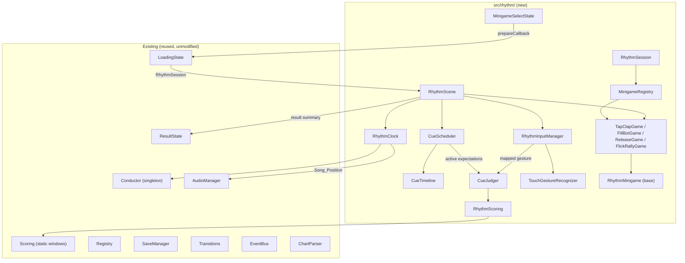
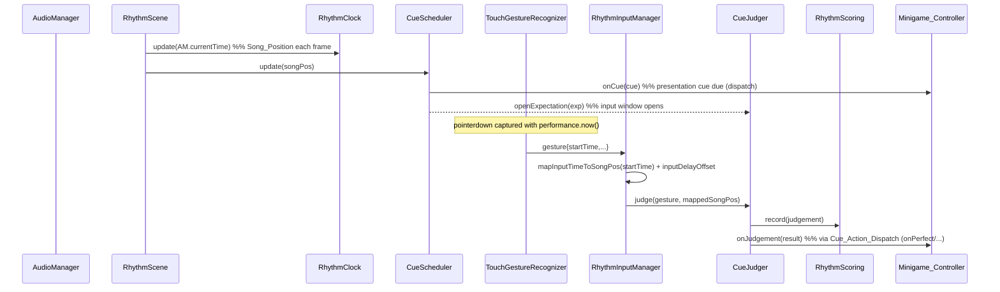
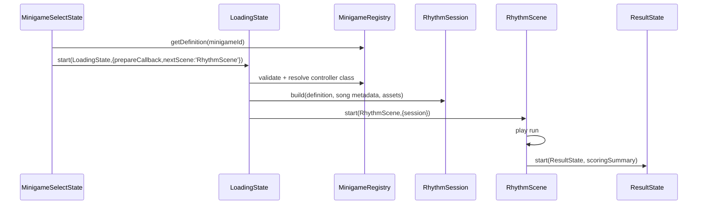

# Design Document

## Overview

This document describes the technical design for the **rhythm-minigame-prototype**: a
playable vertical slice of the Rhythm Heaven-style minigame framework from
`framework_conversion.md`, shipping four data-driven minigames — one per movement type
(Tap, Hold, Release, Flick).

The design adds a self-contained framework under `src/rhythm/` that sits **beside** the
existing FNF gameplay (which is untouched). It reuses the tested timing, audio, loading,
scoring, save, and transition systems already in the repo, and adds only the net-new
pieces the prototype needs.

Runtime flow (Requirement 12):

```
MainMenuState → MinigameSelectState → LoadingState → RhythmScene → ResultState
```

The framework owns timing and judgement; each minigame controller owns meaning and
presentation. Adding a minigame = one JSON definition + one controller class + a registry
entry, with no edits to the framework core (Requirement 11).

### Design goals traceable to requirements

- Data-driven minigames, zero framework edits to add one (R11, R13).
- One movement type per level with distinct gesture handling (R1–R4).
- A single neutral clock wrapping `Conductor` (R5).
- Deterministic, injectable scheduling and judging for tests (R6, R7, R17).
- One input→song-position mapping with the input-delay offset, judged on gesture-start (R7, R8).
- Stability across pause/resume and audio drift (R9).
- Accuracy-first scoring with result bands (R10).
- Mobile canvas handling and full scene teardown (R14, R16).

## Architecture

### Module / component diagram



### Scene registration

`RhythmScene` and `MinigameSelectState` are registered in the Phaser `scene` array in
`src/main.js`. Boot services (`SaveManager.init`, `TouchDeviceDetector.detect`,
`OrientationOverlay.init`) remain init-once in `main.js`; the new scenes never
re-initialize them (per ARCHITECTURE.md).

### Sequence: one cue → gesture → judgement → feedback



### Load → play → result flow



## The two-clock reconciliation (R7, R8)

Two independent time bases exist:

- **Input_Time** — `performance.now()` captured at the pointer event.
- **Song_Position** — milliseconds from `AudioManager.currentTime` (the Web Audio clock),
  fed into `RhythmClock` each frame.

**Single mapping, single location.** `RhythmInputManager.mapInputTimeToSongPosition()` is
the *only* place that converts Input_Time to Song_Position. Each frame `RhythmScene` gives
the input manager the current `AudioManager.currentTime` together with the
`performance.now()` value sampled at that same frame, establishing an anchor:

```
songPositionForInput(inputTime) =
  latestSongPosition + (inputTime - latestFrameInputTime) + inputDelayOffset
```

- `latestSongPosition` = `AudioManager.currentTime` at the last frame.
- `latestFrameInputTime` = `performance.now()` sampled at the last frame.
- `inputDelayOffset` = `SaveManager` calibration value (R8.2).

**Judged on gesture-start.** The recognizer stamps every gesture with the
`performance.now()` captured at `pointerdown` (`gesture.startTime`). A tap is not confirmed
until `pointerup` and a flick not until velocity crosses threshold, but the value passed to
`mapInputTimeToSongPosition` is always `startTime`, never the confirmation time (R7.1, R7.2).
This keeps recognition latency out of the score.

## Components and interfaces

Types live as JSDoc typedefs; shared ones are added to `src/types.js` per the shared-type
convention. Signatures below are the contract; bodies are implementation.

### RhythmClock (R5)

Wraps the `Conductor` singleton. Owns per-run lifecycle (calls `Conductor.reset()` /
`forceBPM` / `mapTimeChanges` at `start`, `destroy` at teardown).

```js
class RhythmClock {
  /** @param {{ conductor?: Conductor }} [deps] */
  constructor(deps = {}) {}
  /** @param {{ bpm: number, offsetMs?: number, timeChanges?: SongTimeChange[] }} cfg */
  start(cfg) {}                 // forceBPM + mapTimeChanges when present
  update(songPositionMs) {}     // delegates Conductor.update(songPos); stores latest
  beatToMs(beat) {}             // via Conductor.getBeatTimeInMs
  msToBeat(ms) {}               // via Conductor.getTimeInSteps / beat length
  get songPositionMs() {}       // latest injected value (R17.3 injectable)
  get songBeat() {}
  destroy() {}
}
```

- R5.4: when `timeChanges` present, `start` calls `Conductor.mapTimeChanges`, so beat↔ms
  honors tempo changes; otherwise constant BPM via `forceBPM`.
- R5.5 / R17.5: `beatToMs`→`msToBeat` round-trips within tolerance (fast-check property).

### CueTimeline (R6)

Immutable, ordered view of a definition's timeline. Beats are baked to ms at build time via
`RhythmClock` (R5), so the scheduler works purely in Song_Position.

```js
class CueTimeline {
  /** @param {TimelineEntry[]} entries @param {RhythmClock} clock */
  static build(entries, clock) {}   // → CueTimeline (entries sorted by resolved ms)
  get cues() {}                     // presentation entries
  get expectations() {}             // expect entries with resolved window open/close ms
}
```

### CueScheduler (R6, R9)

Derives Song_Position from `AudioManager.currentTime` each frame (never integrates its own
clock, R9.4). Injectable position for tests (R17.4).

```js
class CueScheduler {
  /** @param {CueTimeline} timeline @param {EventBusLike} [bus] */
  constructor(timeline, bus) {}
  update(songPositionMs) {}   // fire due cues once; open/close windows; mark misses once
  pause() {} resume() {}      // R9.1/R9.2: no emits while paused; no re-fire on resume
  get activeExpectations() {} // R6.5
  resolve(expectationId, judgement) {} // scheduler-side bookkeeping
}
```

- R6.2/R6.4: a cue fires exactly once; an unresolved expectation is marked `miss` exactly
  once when its window closes.
- R9.3: because position always comes from `AudioManager.currentTime`, `resync`/`forceResync`
  corrections are automatically respected.

### TouchGestureRecognizer (R2, R3, R4, R7, R14, R15, R17)

Net-new. Attaches raw DOM/Phaser pointer listeners to the game canvas (referencing
`TouchInputController` wiring) and classifies interactions. Accepts an injectable clock
function for tests.

```js
class TouchGestureRecognizer {
  /** @param {{ canvas: HTMLCanvasElement, now?: () => number, thresholds?: GestureThresholds, onGesture: (g: Gesture) => void }} cfg */
  constructor(cfg) {}
  attach() {}   // pointerdown/move/up; sets canvas.style.touchAction = 'none' handled by scene
  detach() {}   // removes every listener (R16.1)
  // internal: _onDown/_onMove/_onUp produce Gesture objects
}
```

`Gesture` (added to `src/types.js`):

```js
/**
 * @typedef {Object} Gesture
 * @property {'tap'|'holdStart'|'holdTick'|'release'|'flick'} type
 * @property {number} startTime        // performance.now() at pointerdown (judged moment)
 * @property {number} timestamp        // event time
 * @property {{x:number,y:number}} position
 * @property {{x:number,y:number}} startPosition
 * @property {number} durationMs
 * @property {number} distancePx
 * @property {number} velocityPxPerMs
 * @property {'up'|'down'|'left'|'right'|null} direction
 */
```

Classification rules (R15):
- `tap`: down→up under `maxTapDurationMs` and under `maxTapMovePx`.
- hold: down held past `holdThresholdMs` → emit `holdStart`, then `holdTick` while held
  (R2.2/R2.3); `release` on up carrying hold duration (R3.2).
- `flick`: movement before up exceeds `flickDistancePx` and `flickVelocityPxPerMs`;
  direction from start→release vector (R4.2, R15.4).
- none of the above → emit nothing (R15.5).

Testability (R17.1/R17.2): `_onDown/_onMove/_onUp` accept synthetic event objects and the
`now()` injection, so a test feeds a scripted sequence and asserts the emitted gestures.

### RhythmInputManager (R7, R8)

```js
class RhythmInputManager {
  /** @param {{ recognizer: TouchGestureRecognizer, saveManager: SaveManager, buffer?: InputBuffer }} cfg */
  constructor(cfg) {}
  syncClock(songPositionMs, frameInputTime) {}   // anchor per frame
  mapInputTimeToSongPosition(inputTime) {}        // THE single mapping (R8.3)
  onGesture(gesture) {}   // buffer with original startTime + mapped songPos (R8.4)
  consume() {}            // deliver buffered gestures to the judger
}
```

### CueJudger (R1, R3, R4, R7)

```js
class CueJudger {
  /** @param {{ scheduler: CueScheduler, scoring: RhythmScoring }} cfg */
  constructor(cfg) {}
  /** @param {Gesture} gesture @param {number} mappedSongPositionMs @returns {JudgementResult} */
  judge(gesture, mappedSongPositionMs) {}
}
```

Logic:
- Find active expectation(s) matching gesture type (R7.3). Wrong type while an expectation
  is active → `wrong` (R1.5). Flick direction mismatch → `wrong` (R4.3).
- Timing offset = `mappedSongPositionMs - expectation.targetMs`; map to
  `perfect|good|barely|miss` via `Timing_Window` (delegates to `Scoring.judgeNote` core).
- Already-resolved single-input expectation → reject, no duplicate (R7.5).
- Release before window opens → `wrong` (R3.4).

### RhythmScoring (R10)

Wraps `Scoring` timing windows; adds neutral accumulation + result bands. No health/combo
model.

```js
class RhythmScoring {
  constructor(config = {}) {}     // band thresholds
  record(judgement) {}            // increment category count (R10.1)
  get accuracy() {}               // computed from counts (R10.2)
  get resultBand() {}             // 'Superb'|'OK'|'Try Again' (R10.3)
  summary() {}                    // { score, accuracy, counts, resultBand } (R10.5)
}
```

### RhythmSession (R11, R12)

Per-run value object built by `LoadingState.prepareCallback`: resolved definition, baked
`CueTimeline` inputs, song audio keys/paths, scoring config, controller class reference.

### RhythmMinigame base + controllers (R1–R4, R13)

```js
class RhythmMinigame {
  constructor(scene, session) {}
  create() {}
  update(time, delta, ctx) {}
  onCue(event) {}         // presentation cue dispatch target
  onJudgement(result) {}  // default; specific handlers via Cue_Action_Dispatch
  onMiss(expectation) {}
  destroy() {}            // release owned objects (R16.4)
}
```

Controllers: `TapClapGame` (clap poses via BF/GF atlas), `FillBotGame` (fill meter from
`holdTick` duration, R2.4), `ReleaseGame` (charge/hold then release-on-beat), `FlickRallyGame`
(ball travels, directional flick returns it). Each declares only presentation + gesture
meaning; framework owns timing/judgement.

### MinigameRegistry + Cue_Action_Dispatch (R11)

```js
class MinigameRegistry {
  register(id, controllerClass) {}
  async loadDefinition(id, fetchImpl) {}   // fetch + validate (R11.1/R11.2)
  getControllerClass(id) {}                // R11.3
  validate(def) {}                         // returns {valid, errors[]}
}

// Cue_Action_Dispatch: resolves cue.action / onPerfect / onGood / onBarely / onMiss
// strings to a method on the active controller; missing method → descriptive error (R11.6).
function dispatchCueAction(controller, actionName, payload) {}
```

### MinigameSelectState (R12)

Extends `BaseMenuState`; lists the four definitions, and on select calls
`transitionToScene('LoadingState', { prepareCallback, nextScene: 'RhythmScene', minigameId })`.

### RhythmScene (R9, R12, R14, R16)

Phaser scene. `create(session)`:
- instantiate `RhythmClock`, `CueTimeline`, `CueScheduler`, `CueJudger`, `RhythmScoring`,
  `TouchGestureRecognizer`, `RhythmInputManager`, and the controller;
- set `canvas.style.touchAction = 'none'` (store prior value) (R14.2);
- reuse `AudioManager` unlock handling (R14.5);
- start audio; register `shutdown` handler.

`update(_t, delta)`: `clock.update(AM.currentTime)` → `inputManager.syncClock(...)` →
`scheduler.update(songPos)` → consume+judge buffered gestures → `controller.update(...)`.

`shutdown()` (R16): `recognizer.detach()` (R16.1); remove EventBus subs, cancel
timers/tweens, null owned objects (R16.2); `this.events?.off('shutdown', this.shutdown, this)`
(R16.3); restore canvas `touch-action` (R14.3); `controller.destroy()` (R16.4);
`clock.destroy()`; stop/destroy audio.

## Data Models

### Minigame_Definition JSON schema (R11)

```jsonc
{
  "version": "1.0.0",
  "id": "tap-clap",
  "name": "Tap Clap",
  "movementType": "tap",              // tap | hold | release | flick
  "orientation": "portrait",
  "song": { "id": "tutorial" },       // resolves audio + metadata BPM/timeChanges
  "bpm": 120,                          // optional override; else from song metadata
  "assets": [ { "type": "atlas", "key": "bf", "texture": "...", "atlas": "..." } ],
  "input": {
    "allowedGestures": ["tap"],        // flick adds "flickDirections": ["up"]
    "flickDirections": []
  },
  "scoring": { "windowMs": { "perfect": 45, "good": 90, "barely": 140 },
               "bands": { "superb": 0.9, "ok": 0.6 } },
  "timeline": [
    { "id": "clap-cue-1", "beat": 4, "type": "cue", "action": "leaderClap" },
    { "id": "clap-1", "beat": 5, "type": "expect", "gesture": "tap",
      "targetBeat": 5, "windowMs": { "perfect": 45, "good": 90, "barely": 140 },
      "onPerfect": "clapPerfect", "onGood": "clapGood",
      "onBarely": "clapBarely", "onMiss": "clapMiss" }
  ]
}
```

Definitions live at `assets/data/rhythm/minigames/{tap-clap,fill-bot,release-cue,flick-rally}.json`.

### Per-minigame timeline shape

- **tap-clap** — `allowedGestures:["tap"]`; expect entries `gesture:"tap"` on beats.
- **fill-bot** — `allowedGestures:["hold","release"]`; a `hold_for_duration` expectation
  with a target span; controller reads `holdTick` (R2.4).
- **release-cue** — `allowedGestures:["hold","release"]`; hold begins earlier, `release`
  expectation targets a beat (R3).
- **flick-rally** — `allowedGestures:["flick"]`, `flickDirections:["up"]`; `flick`
  expectations with `direction` (R4).

### Song → asset mapping (R13)

Songs resolve to committed files under `assets/rythm-foundation.assets/`:
`songs/<id>/Inst.ogg` (+`.mp3`), metadata `preload/data/songs/<id>/<id>-metadata.json`
(BPM/`timeChanges`, R13.2). Reused visuals: character atlases
`shared/images/characters/{BOYFRIEND,GF_assets,daddyDearest}.{png,xml}`; countdown
`preload/images/ui/countdown/rythm/{ready,set,go}.png`; judgement popups
`preload/images/ui/popup/rythm/{sick,good,bad,shit}.png` + digits `num0-9`;
`shared/images/noteSplashes.*`; backgrounds `shared/images/stage*`, `week3/week7`; menu SFX
and results music via `AudioManager`. No new assets (R13.4).

## Error Handling

- **Invalid definition** — `MinigameRegistry.validate` returns `{valid:false, errors}`;
  `LoadingState` shows its error path; scene not started (R11.2).
- **Missing controller method** — `dispatchCueAction` throws a descriptive error naming the
  method and cue id (R11.6); surfaced in dev, logged in prod.
- **Wrong / duplicate gesture** — `wrong` judgement; resolved single-input expectations
  reject duplicates (R1.5, R7.5).
- **Release before window** — `wrong` (R3.4); **unmatched expectation** → `miss` on window
  close (R3.5, R6.4).
- **Pause/resume & drift** — scheduler pinned to `AudioManager.currentTime`; no emits while
  paused; no re-fire on resume (R9).
- **No-gesture interaction** — recognizer emits nothing (R15.5).
- **Audio unlock** — reuse existing AudioManager unlock; if context still suspended, run
  starts on first canvas interaction (R14.5).

## Correctness Properties

These invariants must hold for all inputs and are enforced by property-based tests
(fast-check) where marked.

### Property 1: Monotonic scheduling
For any timeline, `CueScheduler` fires entries in non-decreasing Song_Position order; no
entry fires before an earlier one.

**Validates: Requirements 6.1**

### Property 2: Exactly-once resolution
Every Expectation resolves to exactly one outcome (`perfect`/`good`/`barely`/`miss`/`wrong`)
across a run — never zero, never twice.

**Validates: Requirements 6.4, 7.5**

### Property 3: Beat↔ms round-trip
For all beats `b`, `msToBeat(beatToMs(b)) ≈ b` within a defined tolerance.

**Validates: Requirements 5.5, 17.5**

### Property 4: Judge on gesture-start
The Song_Position used for a Judgement derives solely from `gesture.startTime`, independent
of the `pointerup`/confirmation time.

**Validates: Requirements 7.2**

### Property 5: Single input-time mapping
Input_Time → Song_Position conversion occurs only in
`RhythmInputManager.mapInputTimeToSongPosition`.

**Validates: Requirements 8.3**

### Property 6: Position pinning
`CueScheduler`'s Song_Position equals the last `AudioManager.currentTime` it was given; it
never integrates an independent clock.

**Validates: Requirements 9.4**

### Property 7: Listener conservation
After `TouchGestureRecognizer.detach()` (and RhythmScene shutdown), zero pointer listeners
registered by the recognizer remain.

**Validates: Requirements 16.1**

### Property 8: Schema validity
Every committed Minigame_Definition satisfies the schema and maps to a registered controller
class.

**Validates: Requirements 11.1**

### Property 9: No spurious gestures
A pointer interaction satisfying none of the tap/hold/flick thresholds emits no Gesture.

**Validates: Requirements 15.5**

## Testing strategy

Uses the existing Vitest split (`vitest.unit.config.js` / `vitest.integration.config.js`)
and `fast-check`.

Unit:
- **RhythmClock** — beat→ms→beat round-trip property within tolerance (R5.5, R17.5);
  timeChanges conversion (R5.4); injected Song_Position (R17.3).
- **CueScheduler** — injected Song_Position: cues fire once, windows open/close, misses
  marked once, ordering, pause/resume no re-fire (R6, R9, R17.4).
- **CueJudger** — perfect/good/barely/miss windows, wrong type, wrong direction, duplicate
  rejection, release-before-window (R1, R3, R4, R7).
- **TouchGestureRecognizer** — synthetic pointer sequences with injected `now()`: tap, hold
  (start/tick), release, flick + direction, sub-threshold no-op (R15, R17.1/R17.2).
- **RhythmScoring** — counts, accuracy, result bands (R10).
- **MinigameRegistry / Cue_Action_Dispatch** — validation errors, id→class mapping, missing
  method error (R11).

Integration (`tests/integration/`):
- Load a definition through `LoadingState.prepareCallback`, build `RhythmSession`, start
  `RhythmScene`, feed scripted gestures, reach `ResultState` (R12); shutdown teardown
  removes listeners (R16).

Property tests (fast-check):
- Timeline entries never fire out of order (R6.1).
- Every expectation resolves to hit/miss exactly once (R6.4, R7.5).
- Recognizer removes every pointer listener on `detach`/shutdown (R16.1).
- Every committed minigame JSON satisfies the schema (R11.1).

Quality gates (must stay green): `pnpm test`, `pnpm test:integration`, `pnpm lint` (zero
warnings on `src/`), `pnpm typecheck`, `pnpm build`.

## Requirements traceability

| Requirement | Design coverage |
| --- | --- |
| R1 Tap | MinigameRegistry (allowedGestures), CueJudger, TapClapGame, Cue_Action_Dispatch |
| R2 Hold | TouchGestureRecognizer (holdStart/holdTick), FillBotGame, CueJudger duration |
| R3 Release | TouchGestureRecognizer (release), ReleaseGame, CueJudger/CueScheduler |
| R4 Flick | TouchGestureRecognizer (flick+direction), FlickRallyGame, CueJudger |
| R5 Clock | RhythmClock (wraps Conductor, beat↔ms, timeChanges, injectable) |
| R6 Timeline/scheduler | CueTimeline, CueScheduler |
| R7 Gesture-start judging | Gesture.startTime, RhythmInputManager, CueJudger |
| R8 Clock reconciliation | RhythmInputManager single mapping + inputDelayOffset |
| R9 Pause/resume/drift | CueScheduler pinned to AudioManager.currentTime |
| R10 Scoring | RhythmScoring |
| R11 Data-driven | Minigame_Definition schema, MinigameRegistry, Cue_Action_Dispatch |
| R12 Flow | MinigameSelectState → LoadingState → RhythmScene → ResultState |
| R13 Asset reuse | Song→asset mapping section |
| R14 Mobile/canvas | RhythmScene touch-action handling, AudioManager unlock |
| R15 Recognition | TouchGestureRecognizer classification rules |
| R16 Teardown | RhythmScene.shutdown, recognizer.detach, controller.destroy |
| R17 Testability | Injectable now()/Song_Position, synthetic sequences, round-trip property |
