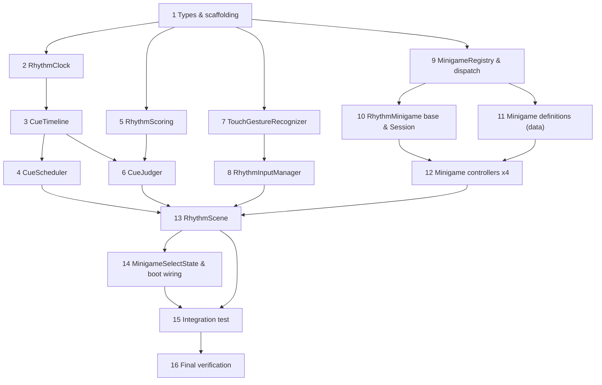

# Implementation Plan

## Overview

Build order follows the design's risk-first strategy: prove the clock, timeline, scheduler,
judger, and gesture recognizer with unit/property tests before wiring the Phaser scene and
the four minigames. Each task is test-driven and leaves the suite green
(`pnpm test`, `pnpm lint`, `pnpm typecheck`). Tasks reference requirements from
`requirements.md` and components/properties from `design.md`.

## Task Dependency Graph



```json
{
  "waves": [
    { "wave": 1, "tasks": ["1"] },
    { "wave": 2, "tasks": ["2", "5", "7", "9"] },
    { "wave": 3, "tasks": ["3", "8", "10", "11"] },
    { "wave": 4, "tasks": ["4", "6", "12"] },
    { "wave": 5, "tasks": ["13"] },
    { "wave": 6, "tasks": ["14"] },
    { "wave": 7, "tasks": ["15"] },
    { "wave": 8, "tasks": ["16"] }
  ]
}
```

## Tasks

- [x] 1. Shared types and rhythm scaffolding
  - Add rhythm typedefs (`Gesture`, `GestureThresholds`, `TimelineEntry`, `Expectation`, `JudgementResult`, `MinigameDefinition`, `RhythmResultSummary`) to `src/types.js`.
  - Create the `src/rhythm/{core,input,minigames,scene,data}/` directory structure.
  - _Requirements: 11.1, 17_

- [x] 2. RhythmClock over Conductor
  - [x] 2.1 Implement `src/rhythm/core/RhythmClock.js` wrapping the `Conductor` singleton (`start` → `forceBPM`/`mapTimeChanges`, `update(songPos)`, `beatToMs`, `msToBeat`, injectable `songPositionMs`, `destroy`).
    - _Requirements: 5.1, 5.2, 5.3, 5.4, 17.3_
  - [x] 2.2 Unit + property tests: beat↔ms round-trip within tolerance, timeChanges conversion, consistency with Conductor for a fixed BPM, injected Song_Position.
    - _Requirements: 5.5, 17.5 (Property 3)_

- [x] 3. CueTimeline
  - Implement `src/rhythm/core/CueTimeline.js` (`build(entries, clock)` bakes beats→ms and sorts; exposes `cues` and `expectations` with resolved window open/close).
  - Unit test: ordering by resolved ms; window bounds derived from windowMs; cue vs expect split.
  - _Requirements: 6.1_

- [x] 4. CueScheduler
  - [x] 4.1 Implement `src/rhythm/core/CueScheduler.js` (`update(songPos)` fires cues once, opens/closes windows, marks unresolved expectations `miss` once; `pause`/`resume`; `activeExpectations`; `resolve`; injectable Song_Position).
    - _Requirements: 6.2, 6.3, 6.4, 6.5, 9.1, 9.2, 9.3, 9.4, 17.4_
  - [x] 4.2 Unit + property tests with injected Song_Position: fire-once, miss-once, ordering, pause/resume no re-fire, position pinning.
    - _Requirements: 6.1, 6.4, 9.4 (Properties 1, 2, 6)_

- [x] 5. RhythmScoring
  - Implement `src/rhythm/core/RhythmScoring.js` reusing `Scoring` timing-window core; `record`, `accuracy`, `resultBand`, `summary`. No health/combo model.
  - Unit test: category counts, accuracy computation, band thresholds, summary shape.
  - _Requirements: 10.1, 10.2, 10.3, 10.4, 10.5_

- [x] 6. CueJudger
  - [x] 6.1 Implement `src/rhythm/core/CueJudger.js` (`judge(gesture, mappedSongPos)`: type match, optional direction match, timing offset → perfect/good/barely/miss/wrong via windows; duplicate rejection; release-before-window → wrong).
    - _Requirements: 1.3, 1.5, 3.3, 3.4, 4.3, 4.4, 7.2, 7.3, 7.4, 7.5_
  - [x] 6.2 Unit + property tests: windows, wrong type, wrong direction, duplicate rejection, exactly-once resolution, judged on gesture-start.
    - _Requirements: 6.4, 7.2, 7.5 (Properties 2, 4)_

- [x] 7. TouchGestureRecognizer
  - [x] 7.1 Implement `src/rhythm/input/TouchGestureRecognizer.js` (`attach`/`detach`; pointerdown/move/up → tap/holdStart/holdTick/release/flick with startTime, position, duration, distance, velocity, direction; injectable `now()`; configurable thresholds; classification per design).
    - _Requirements: 2.2, 2.3, 3.2, 4.2, 7.1, 14.1, 15.1, 15.2, 15.3, 15.4, 15.5, 17.1_
  - [x] 7.2 Unit + property tests with synthetic pointer sequences and injected timestamps: tap, hold start/tick, release, flick + direction, sub-threshold no-op, and listener conservation after `detach`.
    - _Requirements: 15.5, 16.1, 17.1, 17.2 (Properties 7, 9)_

- [x] 8. RhythmInputManager
  - Implement `src/rhythm/input/RhythmInputManager.js` (`syncClock(songPos, frameInputTime)` anchor; single `mapInputTimeToSongPosition` applying SaveManager input-delay offset; buffer preserving original startTime + mapped songPos; `consume`).
  - Unit test: mapping correctness with offset, buffer preserves both times, single-location mapping.
  - _Requirements: 8.1, 8.2, 8.3, 8.4 (Property 5)_

- [x] 9. MinigameRegistry and Cue_Action_Dispatch
  - [x] 9.1 Implement `src/rhythm/minigames/MinigameRegistry.js` (`register`, `loadDefinition` with `validate` returning `{valid, errors}`, `getControllerClass`) and `dispatchCueAction(controller, actionName, payload)` throwing a descriptive error on missing method.
    - _Requirements: 11.1, 11.2, 11.3, 11.6_
  - [x] 9.2 Unit + property tests: schema validation success/failure with field-level errors, id→class mapping, missing-method error, all committed definitions satisfy schema.
    - _Requirements: 11.1 (Property 8)_

- [x] 10. RhythmMinigame base and RhythmSession
  - Implement `src/rhythm/minigames/RhythmMinigame.js` (base lifecycle: create/update/onCue/onJudgement/onMiss/destroy) and `src/rhythm/core/RhythmSession.js` (per-run value object).
  - Unit test: base controller default dispatch + destroy releases objects (mock scene).
  - _Requirements: 11.4, 16.4_

- [x] 11. Minigame definitions (data) for the four movement types
  - Author `assets/data/rhythm/minigames/{tap-clap,fill-bot,release-cue,flick-rally}.json` per schema, each mapping to a committed song and reusing committed atlases/popups/countdown.
  - Unit test: each definition loads and validates; song references resolve to existing asset paths.
  - _Requirements: 11.1, 13.1, 13.2, 13.4_

- [x] 12. Minigame controllers (one per movement type)
  - [x] 12.1 `TapClapGame` (tap): clap poses via character atlas; feedback methods for onPerfect/onGood/onBarely/onMiss.
    - _Requirements: 1.1, 1.2, 1.4, 13.3_
  - [x] 12.2 `FillBotGame` (hold): continuous fill from holdTick duration.
    - _Requirements: 2.1, 2.4, 2.5_
  - [x] 12.3 `ReleaseGame` (release): hold-then-release-on-beat presentation.
    - _Requirements: 3.1, 3.5_
  - [x] 12.4 `FlickRallyGame` (flick): directional flick returns a moving object.
    - _Requirements: 4.1, 4.5_
  - [x] 12.5 Register the four controllers in `MinigameRegistry`; unit test id→controller mapping.
    - _Requirements: 11.3, 11.4_

- [x] 13. RhythmScene
  - [x] 13.1 Implement `src/rhythm/scene/RhythmScene.js` (`create(session)` instantiates clock/timeline/scheduler/judger/scoring/recognizer/input-manager/controller, sets canvas `touch-action:none` storing prior value, reuses AudioManager unlock, starts audio; `update` drives the per-frame loop; transitions to ResultState on end).
    - _Requirements: 9.1, 9.2, 9.3, 12.5, 14.2, 14.4, 14.5_
  - [x] 13.2 Implement full `shutdown` teardown: recognizer.detach, remove EventBus subs, cancel timers/tweens, null owned objects, `events.off('shutdown', ...)`, restore canvas touch-action, controller.destroy, clock.destroy, stop audio.
    - _Requirements: 14.3, 16.1, 16.2, 16.3, 16.4 (Property 7)_

- [x] 14. MinigameSelectState and boot wiring
  - Implement `src/rhythm/ui/MinigameSelectState.js` (extends BaseMenuState; lists the four definitions; on select → LoadingState with prepareCallback building RhythmSession + asset manifest, nextScene RhythmScene).
  - Register `MinigameSelectState` and `RhythmScene` in `src/main.js` scene array; add a MainMenu entry point to MinigameSelectState.
  - _Requirements: 12.1, 12.2, 12.3, 12.4_

- [x] 15. Integration test: full load → play → result
  - Add `tests/integration/rhythmPrototypeFlow.test.js`: load a definition through LoadingState prepareCallback, build RhythmSession, start RhythmScene, feed scripted gestures via the recognizer's synthetic API, assert judgements and reach ResultState; assert shutdown removes recognizer listeners.
  - _Requirements: 12.3, 12.4, 12.5, 16.1_

- [x] 16. Final verification
  - Run `pnpm test`, `pnpm test:integration`, `pnpm lint`, `pnpm typecheck`, `pnpm build`; fix any regressions so all gates pass.
  - _Requirements: all_

## Notes

- Legacy FNF gameplay is left untouched; the rhythm framework is additive under
  `src/rhythm/`. Retiring the FNF route is a non-goal for this prototype.
- No new art or audio: all assets are reused from `assets/rythm-foundation.assets/`.
- Follow repo conventions: ES modules, JSDoc types in `src/types.js`, no new dependencies
  beyond `phaser` and `fast-check`. Every scene obeys the create/shutdown teardown contract.
- Tasks 5 and 7 have no cross-dependency and may be built in parallel after task 1.
- Property-based tests (fast-check) implement the nine Correctness Properties from the
  design; keep them in `*.property.test.js` files consistent with the existing suite.
