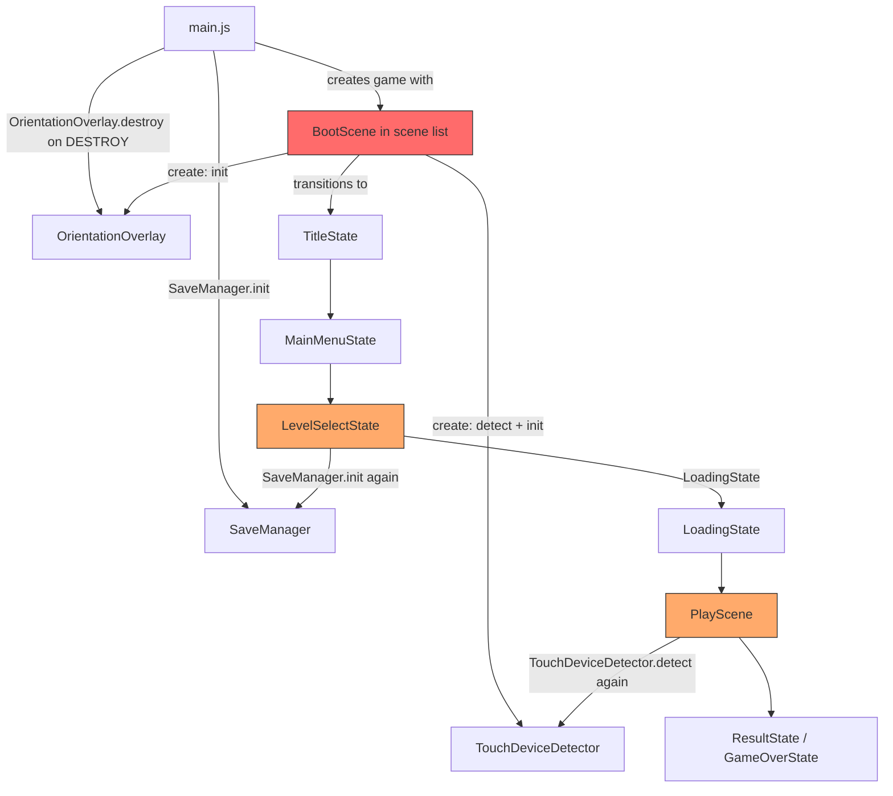
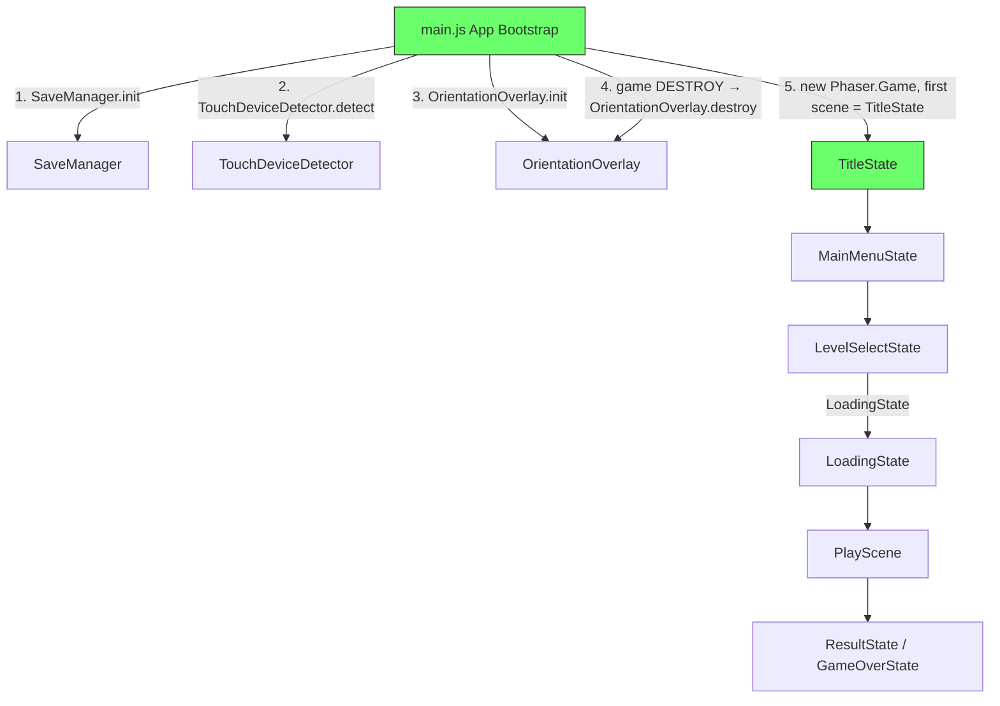
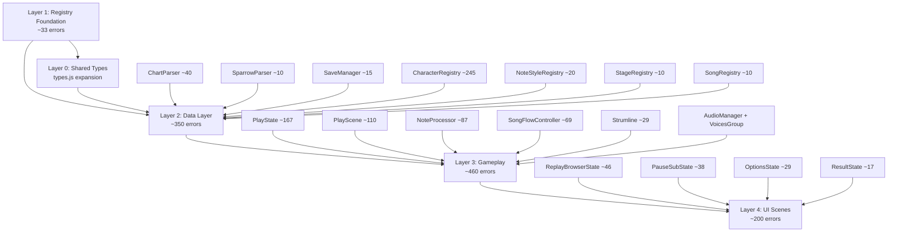

# Design Document: Whole-App Stabilization

## Overview

This design covers a comprehensive stabilization effort for the fnf-phaser application. The codebase currently compiles and runs but carries significant maintenance debt: 1,584 typecheck errors, 38 lint errors + 2 warnings, conflicting typedef families, dead startup code (BootScene), inconsistent scene lifecycles, zero CI coverage, and empty documentation.

The stabilization is organized into six workstreams executed in dependency order:

1. **Startup canonicalization** — Restructure `main.js` to own all boot responsibilities, remove BootScene
2. **Lifecycle cleanup** — Ensure every scene has proper shutdown handlers, remove redundant init calls
3. **Lint fixes** — Fix all 38 errors + 2 warnings without weakening rules
4. **Shared type layer expansion** — Make `src/types.js` the single canonical typedef module
5. **Typecheck debt resolution** — Fix 1,584 errors in dependency order (registry → data → gameplay → UI)
6. **Test/docs/CI alignment** — Replace BootScene tests, add CI workflow, create ARCHITECTURE.md

All changes maintain exact feature parity. No gameplay, scoring, or input behavior changes. The JS+JSDoc toolchain is preserved — no TypeScript migration.

## Architecture

### Current Architecture (Before)



Problems:
- BootScene is in the scene list but never reached at runtime (TitleState is first)
- `SaveManager.init()` called redundantly in LevelSelectState, OptionsState, and InputSystem
- `TouchDeviceDetector.detect()` called redundantly in PlayScene
- OrientationOverlay.init() only called in BootScene.create() which never runs
- No consistent shutdown handlers across scenes

### Target Architecture (After)



Key changes:
- BootScene deleted entirely (source + tests)
- All boot responsibilities move to `main.js` before `new Phaser.Game()`
- Redundant init calls removed from gameplay/menu scenes
- Every scene gets a deterministic `shutdown` handler
- `src/types.js` becomes the single canonical typedef module

## Components and Interfaces

### 1. App Bootstrap (`src/main.js`)

**Responsibility:** One-time initialization of global services before any Phaser scene starts.

**Current state:** Calls `SaveManager.getInstance().init()` and registers `OrientationOverlay.destroy` on game DESTROY, but does NOT call `TouchDeviceDetector.detect()` or `OrientationOverlay.init()`. BootScene is in the scene list.

**Target state:**
```js
// src/main.js — target bootstrap sequence
import SaveManager from './data/SaveManager.js';
import TouchDeviceDetector from './input/TouchDeviceDetector.js';
import OrientationOverlay from './ui/OrientationOverlay.js';

// 1. Initialize save data (idempotent)
SaveManager.getInstance().init();

// 2. Detect touch capability
TouchDeviceDetector.detect();

// 3. Initialize orientation overlay (DOM-based, scene-independent)
OrientationOverlay.init();

const config = {
  // ... same config minus BootScene in scene list
  scene: [
    TitleState, MainMenuState, LevelSelectState, StoryMenuState,
    FreeplayState, OptionsState, PlayScene, PauseSubState,
    GameOverState, ResultState, LoadingState, ReplayBrowserState
  ]
};

const game = new Phaser.Game(config);

game.events.once(Phaser.Core.Events.DESTROY, () => {
  OrientationOverlay.destroy();
});
```

### 2. Scene Lifecycle Contract

Every scene that registers listeners/timers/subscriptions MUST implement a `shutdown` handler that:
- Unregisters all keyboard listeners
- Removes all EventBus subscriptions
- Cancels all timers and tweens
- Nulls references to Phaser game objects
- Calls `this.events?.off('shutdown', this.shutdown, this)`

**Scenes requiring shutdown audit:**

| Scene | Has shutdown? | Needs fixes? |
|-------|:---:|:---:|
| TitleState | ✅ | Minor — verify attract timer cleanup |
| MainMenuState | Via BaseMenuState | ✅ OK |
| LevelSelectState | ✅ | Remove `saveManager.init()` from `create()` |
| OptionsState | ✅ | Remove `saveManager.init()` from `create()` |
| PlayScene | ✅ | Remove `TouchDeviceDetector.detect()` from `create()` |
| PauseSubState | ✅ | OK |
| GameOverState | Needs audit | Add if missing |
| ResultState | Needs audit | Add if missing |
| LoadingState | ✅ | OK |
| StoryMenuState | Needs audit | Add if missing |
| FreeplayState | Needs audit | Add if missing |
| ReplayBrowserState | Needs audit | Add if missing |

### 3. Shared Type Layer (`src/types.js`)

**Responsibility:** Single canonical location for all cross-module JSDoc typedefs.

**Current conflicts to resolve:**

| Typedef | Locations | Resolution |
|---------|-----------|------------|
| `NoteData` | `types.js` (direction-based), `NoteSprite.js` (direction-based), `ChartParser.js` (data-based) | Unify: `types.js` keeps `direction` field; ChartParser outputs `data` field as `RawChartNote`, mapped to `NoteData` at parse boundary |
| `SongMetadata` | `types.js` (flat bpm), `ChartParser.js` (nested playData) | Unify: `types.js` adopts ChartParser's richer structure as `ParsedSongMetadata`; keep simple `SongMetadata` for UI consumption |
| `ChartData` | `types.js` (single scrollSpeed number), `ChartParser.js` (per-difficulty map) | Unify: `types.js` adopts ChartParser's per-difficulty structure |

**New typedefs to add:**

- `SceneTransitionPayload` — typed payloads for each scene's `init(data)`
- `LoadingConfig` / `LoadingResult` — already in LoadingState, move to types.js
- `RegistryConfig` — complete with `entityName`, `displayInfoFields`
- `ReplayData` / `ReplayFrame` — for ReplayBrowserState and replay system
- `AudioBoundaryInterfaces` — typed wrappers for Phaser sound manager variants
- `PreparedPlaySession` — the session object passed to PlayScene

### 4. Registry Type Foundation (`src/core/Registry.js`)

**Current issues (33 typecheck errors):**
- Generic type parameters `T` and `J` not constrained — `entry.id`, `entry.destroy` fail
- `createRegistry` factory returns untyped `ConfigRegistry` — `getInstance()` returns `any`
- Dynamic helper methods (`get${entityName}Data`, etc.) use implicit `any` indexing
- `RegistryConfig` typedef missing `entityName` and `displayInfoFields`

**Resolution strategy:**
1. Add `@typedef {Object} RegistryEntryBase` with `{string} id` and `{function(): void} [destroy]`
2. Constrain `@template {RegistryEntryBase} T`
3. Complete `RegistryConfig` typedef with `entityName` and `displayInfoFields`
4. Type `getInstance()` return as the concrete registry class
5. For dynamic helpers: add explicit JSDoc `@type` annotations on each generated method, or declare them as known methods on the prototype with `@this` annotations

### 5. Lint Fix Strategy

**38 errors + 2 warnings across 6 files:**

| File | Issue Type | Count |
|------|-----------|-------|
| AudioManager.js | curly braces, prettier | ~6 |
| PlayScene.js | curly braces, prettier | ~8 |
| BaseMenuState.js | curly braces, prettier | ~4 |
| LevelSelectState.js | curly braces, unused vars | ~6 |
| OptionsState.js | curly braces, prettier | ~8 |
| PauseSubState.js | curly braces, prettier | ~6 |

**Approach:**
- Run `npm run lint:fix` first to auto-fix prettier formatting
- Manually fix remaining `curly` violations (add braces to single-line if/else)
- Remove or prefix unused variables with `_`
- Verify no semantic changes via test suite

### 6. Typecheck Resolution Order

The 1,584 errors are resolved in dependency order so each layer's fixes unlock the next:



**Common fix patterns:**
- `Object` parameter types → concrete `@param {RawChartJSON} json` typedefs
- Missing `@returns` → add explicit return type annotations
- `Property 'X' does not exist on type 'Object'` → replace `Object` with specific typedef
- Implicit `any` from dynamic indexing → add `@type` casts or `Record<string, T>` typedefs
- Nullable access → add null guards or `@type {X | null}` annotations
- Phaser boundary casts → narrow `/** @type {Phaser.Sound.WebAudioSound} */` at call site only

### 7. CI Pipeline (`.github/workflows/fnf-phaser-ci.yml`)

```yaml
name: fnf-phaser CI
on:
  push:
    paths: ['fnf-phaser/**']
  pull_request:
    paths: ['fnf-phaser/**']
jobs:
  verify:
    runs-on: ubuntu-latest
    defaults:
      run:
        working-directory: fnf-phaser
    steps:
      - uses: actions/checkout@v4
      - uses: actions/setup-node@v4
        with:
          node-version: 20
          cache: npm
          cache-dependency-path: fnf-phaser/package-lock.json
      - run: npm ci
      - run: npm run lint
      - run: npm run typecheck
      - run: npm run test
      - run: npm run test:integration
      - run: npm run build
```

### 8. Test Alignment

**BootScene test replacement:**
- Delete `tests/BootScene.test.js`
- Add `tests/AppBootstrap.test.js` verifying:
  - SaveManager.init called exactly once
  - TouchDeviceDetector.detect called exactly once
  - OrientationOverlay.init called exactly once
  - OrientationOverlay.destroy called on game DESTROY event
  - No scene depends on BootScene key at runtime

**Console noise suppression:**
- Spy on `console.warn` / `console.error` in tests that exercise error paths
- Restore after each test via `vi.restoreAllMocks()`

## Data Models

### Core Type Definitions (expanded `src/types.js`)

```js
// ── Raw Chart JSON (as parsed from disk) ──
/** @typedef {Object} RawChartNote
 *  @property {number} t - timestamp ms
 *  @property {number} d - data (lane index 0-7)
 *  @property {number} [l=0] - hold length ms
 *  @property {string} [k] - note kind
 */

/** @typedef {Object} RawChartJSON
 *  @property {string} version
 *  @property {Object<string, number>} scrollSpeed
 *  @property {Array<{t: number, e: string, v: *}>} events
 *  @property {Object<string, RawChartNote[]>} notes
 *  @property {string} [generatedBy]
 */

/** @typedef {Object} RawMetadataJSON
 *  @property {string} version
 *  @property {string} songName
 *  @property {string} artist
 *  @property {Object} playData
 *  @property {Array<{t: number, bpm: number, n?: number, d?: number}>} timeChanges
 */

// ── Canonical application-level types ──
/** @typedef {Object} NoteData
 *  @property {number} time
 *  @property {number} direction - 0-3
 *  @property {number} length
 *  @property {string} [kind]
 *  @property {number} [strumlineIndex]
 */

/** @typedef {Object} ChartData
 *  @property {string} version
 *  @property {Object<string, number>} scrollSpeed - per-difficulty
 *  @property {NoteData[]} notes
 *  @property {SongEventData[]} events
 *  @property {string} [generatedBy]
 *  @property {string} [variation]
 */

// ── Scene Payloads ──
/** @typedef {Object} PlayScenePayload
 *  @property {PreparedPlaySession} [session]
 *  @property {object} [chart]
 *  @property {object} [songData]
 *  @property {string} [difficulty]
 */

/** @typedef {Object} LoadingStatePayload
 *  @property {string} nextScene
 *  @property {Object} [nextSceneData]
 *  @property {string[]} [assets]
 *  @property {Function} [loadCallback]
 *  @property {Function} [prepareCallback]
 *  @property {string} [message]
 *  @property {number} [minDuration]
 */

/** @typedef {Object} ResultStatePayload
 *  @property {number} score
 *  @property {string} rank
 *  @property {number} accuracy
 *  @property {boolean} newHighScore
 *  @property {object} [songData]
 *  @property {object} [tallies]
 */

// ── Registry ──
/** @typedef {Object} RegistryConfig
 *  @property {string} registryId
 *  @property {string} dataFilePath
 *  @property {string} [versionRule]
 *  @property {string} [entityName]
 *  @property {string[]} [displayInfoFields]
 *  @property {function(Object, string=): *} cleanData
 *  @property {function(Object, string=): boolean} [validateData]
 *  @property {function(string, *): *} createEntry
 */
```

### Registry Entry Shapes

Each registry produces entries with a known shape:

| Registry | Entry Shape |
|----------|------------|
| CharacterRegistry | `{ id, data: CharacterData, name, renderType, animationNames }` |
| NoteStyleRegistry | `{ id, data: NoteStyleCleanedData, name, fallback, assetKeys }` |
| StageRegistry | `{ id, data: StageData, name }` |
| SongRegistry | `{ id, data: SongData, name }` |

### Phaser Boundary Casts

Narrow casts are permitted ONLY at Phaser third-party boundaries:

```js
// ✅ Allowed: narrow cast at Phaser sound manager boundary
const ctx = /** @type {AudioContext} */ (this.sound?.context);

// ❌ Not allowed: propagating any into application code
/** @type {any} */
const data = this.cache.json.get(key);
```


## Correctness Properties

*A property is a characteristic or behavior that should hold true across all valid executions of a system — essentially, a formal statement about what the system should do. Properties serve as the bridge between human-readable specifications and machine-verifiable correctness guarantees.*

### Property 1: Zero dead boot references

*For any* source file (`.js`) or documentation file (`.md`) in the fnf-phaser directory, the file shall contain zero occurrences of the string literals `"BootScene"` or `"TitleScene"` used as scene keys, and zero references describing BootScene as an active runtime component.

**Validates: Requirements 1.6, 8.4**

### Property 2: Scene shutdown completeness

*For any* scene class that registers input listeners, EventBus subscriptions, timers, or window listeners in its `create()` method, calling `shutdown()` shall result in all such registrations being removed and all owned Phaser game object references being set to `null`.

**Validates: Requirements 2.1, 2.2**

### Property 3: No boot service re-initialization in scenes

*For any* gameplay or menu scene (excluding `main.js` app bootstrap), the scene's `create()` method shall not call `SaveManager.getInstance().init()`, `TouchDeviceDetector.detect()`, or `OrientationOverlay.init()`.

**Validates: Requirements 2.4**

### Property 4: No duplicate cross-module typedefs

*For any* JSDoc `@typedef` name that is defined in `src/types.js`, no other source file in `src/` shall define a `@typedef` with the same name.

**Validates: Requirements 4.3, 4.4, 4.5, 4.6**

### Property 5: No bare Object parameter types in data layer

*For any* public method in the data layer modules (`ChartParser`, `SparrowParser`, `SaveManager`, and all registry implementations), the method's JSDoc `@param` annotations shall not use bare `Object` as the parameter type — they shall use a concrete named typedef instead.

**Validates: Requirements 5.5**

## Error Handling

### Startup Errors

- If `SaveManager.init()` fails during bootstrap, the error is caught and logged. The game continues with in-memory defaults (existing behavior preserved).
- If `TouchDeviceDetector.detect()` throws (e.g., in a non-browser environment), the detector defaults to `isTouchDevice = false`. No crash.
- If `OrientationOverlay.init()` fails (e.g., `document` unavailable), it returns silently. No crash.

### Scene Lifecycle Errors

- If a scene's `shutdown` handler throws, Phaser catches it internally. The design ensures shutdown handlers use defensive null checks (`this.healthBar?.destroy()`) to avoid cascading errors.
- If a scene transition target doesn't exist, Phaser logs a warning. The design does not change this behavior.

### Typecheck Fix Errors

- Narrow JSDoc casts at Phaser boundaries may suppress legitimate type errors. The design constrains casts to boundary call sites only and requires that `any` does not propagate into application code.
- If a typedef change breaks downstream consumers, the typecheck itself catches it — the zero-diagnostic gate ensures consistency.

### Lint Fix Errors

- Lint fixes are purely cosmetic (curly braces, formatting, unused vars). The test suite serves as the behavioral regression gate. If any lint fix changes semantics, the test suite catches it.

### CI Pipeline Errors

- If any CI step fails, the workflow fails and blocks merge. No `continue-on-error` is used.
- Network failures during `npm ci` cause the workflow to fail and can be retried.

## Testing Strategy

### Dual Testing Approach

This stabilization uses both unit tests and property-based tests:

- **Unit tests** verify specific examples: bootstrap init counts, file existence checks, lint/typecheck exit codes, scene configuration, and LoadingState behavior paths.
- **Property-based tests** verify universal properties across generated inputs: shutdown completeness across all scenes, absence of dead references across all files, absence of duplicate typedefs, and absence of bare Object types.

### Property-Based Testing Configuration

- **Library:** `fast-check` (already in devDependencies)
- **Minimum iterations:** 100 per property test
- **Tag format:** `Feature: whole-app-stabilization, Property {number}: {property_text}`

Each correctness property maps to a single property-based test:

| Property | Test Strategy |
|----------|--------------|
| 1: Zero dead boot references | Generate random file paths from the src/ and docs/ directories, read each file, assert no BootScene/TitleScene scene key matches |
| 2: Scene shutdown completeness | For each scene class, instantiate with mocks, call create(), then shutdown(), assert all listener counts return to zero and owned references are null |
| 3: No boot service re-initialization | For each scene class, spy on SaveManager.init/TouchDeviceDetector.detect/OrientationOverlay.init, call create(), assert zero calls to these methods |
| 4: No duplicate cross-module typedefs | Parse all .js files in src/, extract @typedef names, assert no name appears in both types.js and another file |
| 5: No bare Object params in data layer | Parse all data layer .js files, extract @param annotations, assert none use bare `Object` type |

### Unit Test Coverage

Key unit tests (non-property):

- **AppBootstrap:** SaveManager.init called once, TouchDeviceDetector.detect called once, OrientationOverlay.init called once, OrientationOverlay.destroy on DESTROY event
- **Scene config:** TitleState is first scene, BootScene not in scene list, all 12 scenes registered
- **LoadingState:** success path, prepareCallback failure, asset deduplication, retry, min-duration guard, next-scene handoff
- **File deletion:** BootScene.js and BootScene.test.js do not exist
- **CI workflow:** YAML file exists, contains all 5 verification commands, uses fnf-phaser working directory
- **ARCHITECTURE.md:** exists, contains required sections, no active BootScene references
- **Lint baseline:** `npm run lint` exits with code 0
- **Typecheck baseline:** `npm run typecheck` exits with code 0
- **Build:** `npm run build` exits with code 0

### Console Noise Suppression

Tests that exercise error paths (LoadingState failure, registry load errors, etc.) shall spy on `console.warn` and `console.error` before the test and restore via `vi.restoreAllMocks()` after. This ensures successful test runs produce clean output without masking real failures.
